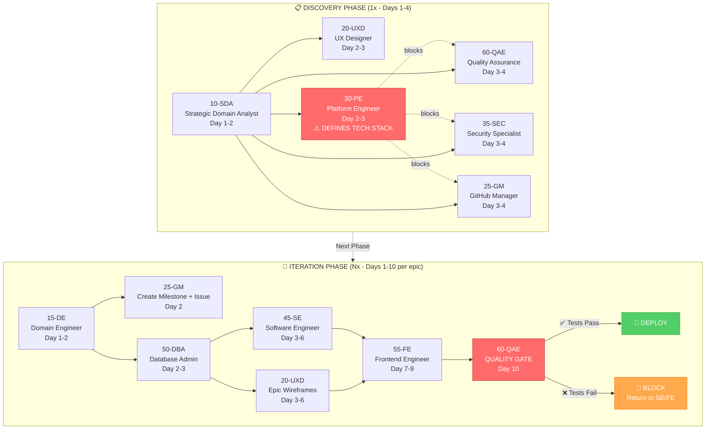

# DDD Workflow Guide

**Objetivo:** Guia prático do processo de desenvolvimento Domain-Driven Design (DDD) para projetos pequenos e médios.

---

## 📖 Índice

- [Visão Geral](#-visão-geral)
- [Agentes (10)](#-agentes-10)
- [Workflow Visualization](#-workflow-visualization)
- [Estrutura do Processo](#-estrutura-do-processo)
  - [Fase 1: Discovery](#fase-1-discovery-1x-por-projeto)
  - [Fase 2: Iteração por Épico](#fase-2-iteração-por-épico-n-iterações)
- [Épicos: Por Funcionalidade vs Por BC](#-épicos-por-funcionalidade-vs-por-bc)
- [Database Workflow: SQL-First Approach](#-database-workflow-sql-first-approach)
- [Sistema de Feedback](#-sistema-de-feedback)
- [Think Mode vs Plan Mode](#-think-mode-vs-plan-mode)
- [Modos de Execução dos Agentes](#-modos-de-execução-dos-agentes)
- [Estrutura de Pastas](#-estrutura-de-pastas)
- [Workflow Típico](#-workflow-típico)
- [Métricas de Sucesso](#-métricas-de-sucesso)
- [Configuração de Caminhos](#-configuração-de-caminhos)
- [Validação de Qualidade](#-validação-de-qualidade)
- [Referências](#-referências)

---

## 🎯 Visão Geral

Este workflow combina **DDD estratégico e tático** com **desenvolvimento ágil** através de **10 agentes especializados** trabalhando iterativamente para entregar valor incremental de forma simples e pragmática.

### Princípios

1. **Épicos por Funcionalidade** - não por Bounded Context
2. **Iteração rápida** - feedback contínuo
3. **Documentação mínima viável** - apenas o essencial
4. **Código como documentação** - código limpo é a fonte primária
5. **Deploy incremental** - por épico completo

---

## 👥 Agentes (10)

| Ordem | Sigla | Agente | Quando Executa | Escopo | Dependências |
|-------|-------|--------|----------------|--------|--------------|
| 1 | SDA | Strategic Domain Analyst | 1x Discovery (Dia 1-2) | Sistema completo | - |
| 2 | UXD | User Experience Designer | 1x Discovery (Dia 2-3) + Por épico | Fundamentos + Wireframes | SDA |
| 3 | PE | Platform Engineer | 1x Discovery (Dia 2-3) | Define stack + ambientes | SDA |
| 4 | QAE | Quality Assurance Engineer | 1x Discovery (Dia 3-4) + Por épico | Estratégia de testes + Quality gate | **PE** (stack) |
| 5 | SEC | Security Specialist | 1x Discovery (Dia 3-4) | Baseline de segurança | **PE** (stack) |
| 6 | GM | GitHub Manager | 1x Discovery (Dia 3-4) + Por épico | Setup CI/CD + Issues | **PE** (stack) |
| 7 | DE | Domain Engineer | Por épico | Modelagem tática | SDA |
| 8 | DBA | Database Administrator | Por épico | Migrations e validação | DE, PE |
| 9 | SE | Software Engineer | Por épico | Implementação backend | DE, DBA |
| 10 | FE | Frontend Engineer | Por épico | Implementação frontend | SE, UXD |

**⚠️ Atenção:** PE (Platform Engineer) **deve executar ANTES** de QAE, SEC e GM na Discovery, pois define o stack tecnológico que estes agentes precisam para escolher ferramentas compatíveis.  

Ver detalhes e **exemplos de invocação** em [01-Agents-Overview.md](01-Agents-Overview.md)

---

## 🔄 Workflow Visualization

O diagrama abaixo mostra o fluxo completo do DDD Workflow v1.0 com os 10 agentes especializados:



**Legenda:**
- **Setas sólidas (→):** Fluxo sequencial obrigatório  
- **Setas tracejadas (-.->):** Dependência de bloqueio (PE define tech stack que QAE/SEC/GM precisam)  
- **Cores:**  
  - 🔴 Vermelho: Critical path (PE define stack, QAE é quality gate)  
  - 🟢 Verde: Deploy aprovado  
  - 🟠 Laranja: Deploy bloqueado (retorna para correções)  

**Fases:**
- **Discovery (1x):** Executado uma vez no início do projeto (Days 1-4)  
- **Iteration (Nx):** Executado N vezes, uma por épico funcional (Days 1-10 por épico)  

---

## 🏗️ Estrutura do Processo

### **Fase 1: Discovery (1x por projeto)**

Executada uma vez no início para estabelecer a fundação estratégica **mínima**.

```
Dia 1-2: SDA
  - Event Storming  
  - Context Map  
  - Linguagem Ubíqua  
  - Épicos priorizados (alto nível)  

Dia 2-3: [UXD + PE] (PARALELO - Fundações Independentes)

  UXD:
    - Fundamentos de Design (cores, tipografia, componentes base)  

  PE:
    - Define Stack Tecnológico (Backend, Frontend, Database)  
    - Setup de Ambientes (dev/stage/prod com SCRIPTS)  
    - Docker Compose  
    - Setup de banco de dados  
    - Scripts de deploy (ainda não IaC)  

Dia 3-4: [QAE + SEC + GM] (PARALELO - Dependem do Stack do PE)

  QAE:
    - Estratégia de Testes baseada no stack do PE  
    - Ferramentas de teste (unit, integration, E2E)  
    - Cobertura mínima e critérios de qualidade  

  SEC:
    - Baseline de Segurança (threat model básico)  
    - Checklist essencial de segurança  
    - LGPD/compliance mínimo  
    - Ferramentas de segurança compatíveis com stack  

  GM:
    - Setup GitHub (labels, template PR, proteção de branch)  
    - CI/CD básico baseado no stack do PE (build + test)  
    - GitHub Actions (deploy staging/prod)  
    - ❌ NÃO cria issues (épicos ainda não refinados)  
```

**Duração:** 3-4 dias  
**Deliverables:** 7 documentos (SDA: 3, UXD: 1, PE: 1, QAE: 1, SEC: 1, GM: 1)  

**Dependências Críticas na Discovery:**

```
SDA (Dia 1-2)
  ↓
  ├─→ UXD (Dia 2-3) - Independente de stack
  └─→ PE (Dia 2-3) - Define stack tecnológico
        ↓
        ├─→ QAE (Dia 3-4) - Ferramentas de teste baseadas no stack
        ├─→ SEC (Dia 3-4) - Ferramentas compatíveis com stack
        └─→ GM (Dia 3-4) - CI/CD baseado no stack
```

**Por que esta ordem?**
- ✅ **PE primeiro:** Define backend/frontend/database stack → decisões que impactam QAE, SEC, GM
- ✅ **UXD paralelo com PE:** Design independe de stack técnico
- ✅ **QAE, SEC, GM depois de PE:** Escolhem ferramentas compatíveis com o stack definido  

---

### **Fase 2: Iteração por Épico (N iterações)**

Executada para cada épico prioritário, entregando funcionalidade completa ponta-a-ponta.

```
┌──────────────────────────────────────────────────────┐
│  ÉPICO: [Nome da Funcionalidade]                     │
│  Ex: "EPIC-01: Criar e Visualizar Estratégia"        │
└──────────────────────────────────────────────────────┘
                        ↓
        ┌───────────────────────────────────────┐
        │ Dia 1-2: DE                           │
        │ DE-01-[NomeEpico]-Domain-Model.md     │
        │ - Aggregates detalhados               │
        │ - Domain Events                       │
        │ - Use Cases (specs completas)         │
        │ - Interfaces de repositório           │
        │ - Regras de negócio (invariantes)     │
        └───────────────────────────────────────┘
                        ↓
        ┌───────────────────────────────────────┐
        │ Dia 2: GM                             │
        │ - Lê DE-01                            │
        │ - Cria issue detalhada no GitHub      │
        │ - Issue: use cases + critérios de     │
        │   aceitação + tarefas                 │
        └───────────────────────────────────────┘
                        ↓
        ┌───────────────────────────────────────┐
        │ Dia 2-3: DBA                          │
        │ DBA-01-[NomeEpico]-Migrations         │
        │ - Valida schema do DE-01              │
        │ - Cria migrations (EF Core)           │
        │ - Estratégia de indexação             │
        └───────────────────────────────────────┘
                        ↓
        ┌────────────────────────────────────────┐
        │ Dia 3-6: SE + UXD (PARALELO)           │
        │                                        │
        │ SE:                      UXD:          │
        │ - Camada de domínio      - UXD-01      │
        │ - Camada de aplicação    - Wireframes  │
        │ - Infraestrutura         - Componentes │
        │ - Camada de API          específicos   │
        │ - Testes unitários (≥70%) por épico   │
        └────────────────────────────────────────┘
                        ↓
        ┌───────────────────────────────────────┐
        │ Dia 7-9: FE                           │
        │ - Implementa UI (usando UXD-01)       │
        │ - Integra com APIs do SE              │
        │ - Testes de componentes               │
        │ - Gerenciamento de estado             │
        └───────────────────────────────────────┘
                        ↓
        ┌───────────────────────────────────────┐
        │ Dia 9 (OPCIONAL): PE + SEC Checkpoints│
        │ - PE: Quick performance review (15min)│
        │   • N+1 queries? Missing indexes?     │
        │   • Async/await correct?              │
        │ - SEC: Quick security review (15min)  │
        │   • OWASP Top 3? Authorization?       │
        │   • Input validation? Secrets safe?   │
        │                                       │
        │ ⚠️ QUANDO EXECUTAR (ver Decision      │
        │    Matrix para critérios completos):  │
        │ PE: Queries >3 JOINs, real-time       │
        │     calculations, Epic 4+, API extern │
        │ SEC: PII/financial data, auth logic,  │
        │      Epic 4+, upload arquivos         │
        │                                       │
        │ 📋 Ref: 07-PE-SEC-Checkpoint-Guide.md │
        │                                       │
        └───────────────────────────────────────┘
                        ↓
        ┌───────────────────────────────────────┐
        │ Dia 10: QAE (QUALITY GATE)            │
        │ - Testes de integração (SE ↔ FE)      │
        │ - Testes E2E (jornadas do usuário)    │
        │ - Testes de regressão (épicos antigos)│
        │ - Smoke test                          │
        │                                       │
        │ ✅ Testes passam → DEPLOY RELEASE     │
        │ ❌ Testes falham → RETORNA SE/FE      │
        └───────────────────────────────────────┘
                        ↓
        ┌───────────────────────────────────────┐
        │ DEPLOY                                │
        │ - PE: Deploy staging (GitHub Actions) │
        │ - QAE: Smoke test staging             │
        │ - PE: Deploy prod               │
        │ - Monitoramento                       │
        └───────────────────────────────────────┘
                        ↓
              [FEEDBACK DO USUÁRIO]
                        ↓
             [Próximo Épico]
```

**Duração por épico:** 10 dias (2 semanas)  
**Deliverables:** 3 documentos (DE-01, DBA-01, UXD-01) + código + testes + 1 issue GitHub  

---

## 📐 Épicos: Por Funcionalidade vs Por BC

### ✅ CORRETO: Épicos por Funcionalidade (Transversal)

**Exemplo:**
```
Épico 1: "Criar e Visualizar Estratégias"
  → Atravessa: BC Gestão de Estratégias + BC Dados de Mercado + BC Portfólio
  → Entrega: CRUD de estratégias (qualquer tipo), visualização, validação

Épico 2: "Calcular Greeks e P&L em Tempo Real"
  → Atravessa: BC Estratégia + BC Risco + BC Dados de Mercado
  → Entrega: Cálculo automático, atualização real-time, dashboard

Épico 3: "Alertas Automáticos de Risco"
  → Atravessa: BC Risco + BC Estratégia
  → Entrega: Configuração de alertas, notificações, monitoramento
```

**Por quê?**
- Entrega valor de negócio completo  
- Usuário pode testar funcionalidade ponta-a-ponta  
- Feedback real e útil  
- Integração de BCs validada cedo  

### ❌ EVITAR: Épicos por Bounded Context

```
Épico 1: "BC Gestão de Estratégias"
Épico 2: "BC Gestão de Risco"
```

**Problema:** Usuário não consegue usar nada até que todos os BCs estejam prontos.  

---

## 🗄️ Database Workflow: SQL-First Approach

### Decisão Arquitetural

Este projeto adota **SQL-First** onde DBA cria schema migrations ANTES de SE criar EF models.

**Justificativa:**
- **Alinhamento com ordem de execução**: DBA executa Day 2-3 (APÓS DE criar domain model Day 1-2)
- **Database como fonte de verdade**: Schema define estruturas de dados autoritativas
- **Otimização de performance**: DBA otimiza índices e constraints desde o início
- **PostgreSQL-specific**: Usa recursos avançados (JSONB, GIN indexes, partial indexes) melhor expressados em SQL
- **Estratégia multi-ambiente**: Permite migrations de ALTER USER para senhas staging/prod

### Sequência do Workflow

```
Day 1-2: DE → Cria DE-01-[EpicName]-Domain-Model.md
              (Aggregates, Entities, Value Objects, Repository interfaces)

Day 2-3: DBA → Lê DE-01
              → Cria SQL migrations em 04-database/migrations/ (diretório criado pelo DBA)
              → Cria DBA-01-[EpicName]-Schema-Review.md
              → Atualiza 04-database/README.md (arquivo criado pelo DBA no primeiro épico)

Day 3-6: SE → Lê DBA-01 e migrations
             → Scaffolds EF models: dotnet ef dbcontext scaffold
             → Implementa repositories mapeando para schema DBA
             → Cria use cases e API
```

### Deliverables DBA (Por Epic)

1. **DBA-01-[EpicName]-Schema-Review.md** - Decisões de design (WHY/WHAT)
2. **04-database/README.md** - Guia operacional (HOW) - Criado no primeiro épico, atualizado nos seguintes
3. **Migrations SQL** - `04-database/migrations/NNN_*.sql` (estrutura criada pelo DBA)

### Consumo pelo SE: Hybrid Scaffolding Strategy

**Problema:** `dotnet ef dbcontext scaffold --force` regenera TODOS os arquivos (não só novos), causando perda de customizações.

**Solução:** **Hybrid Approach (Partial Classes Pattern)** - separa código auto-gerado de lógica de domínio customizada.

#### File Organization

| Localização | Tipo | Tocado por Scaffold? | Propósito |
|-------------|------|---------------------|-----------|
| `src/Infrastructure/Data/Models/*.cs` | Auto-Generated | **SIM - Sobrescrito todo epic** | Entidades base (só colunas DB) |
| `src/Domain/Entities/*.Partial.cs` | Custom | **NÃO - Nunca tocado** | Lógica de domínio, eventos |
| `src/Infrastructure/Persistence/Configurations/*.cs` | Custom | **NÃO - Nunca tocado** | FluentAPI (Value Objects, JSONB) |
| `src/Infrastructure/Data/ApplicationDbContext.Partial.cs` | Custom | **NÃO - Nunca tocado** | Registro de configurações |

#### Workflow Across Epics

**EPIC-01 (Scaffold Inicial):**
```bash
# Scaffold gera Models/User.cs, Models/SubscriptionPlan.cs
dotnet ef dbcontext scaffold ... --force

# SE cria partial classes customizadas
# Domain/Entities/User.Partial.cs - Lógica de negócio
# Infrastructure/Persistence/Configurations/UserConfiguration.cs - FluentAPI
```

**EPIC-02+ (Re-Scaffold):**
```bash
# MESMO comando - scaffold TODAS as tabelas novamente
dotnet ef dbcontext scaffold ... --force

# O que acontece:
# ✅ Arquivos NOVOS: Models/Strategy.cs
# ⚠️ Arquivos EPIC-01 REGENERADOS: Models/User.cs (SOBRESCRITO)
# ✅ Arquivos CUSTOM INTOCADOS: Domain/Entities/User.Partial.cs (NÃO tocado)
```

**Resultado:** Customizações SEGURAS porque ficam em arquivos separados nunca tocados pelo scaffold.

**Guia Completo:** Ver `04-database/README.md` seção "Scaffolding Strategy" (criado pelo DBA Agent no primeiro épico)

### Integration Test Fixtures (TestContainers)

**Responsabilidade:** SE cria fixtures de teste usando templates disponibilizados.

**Templates Disponíveis:**
- `.agents/templates/10-software-engineering/fixtures/DatabaseFixture.cs.template`
- `.agents/templates/10-software-engineering/fixtures/DatabaseCollection.cs.template`

**Workflow SE:**
```bash
# 1. Copiar templates para projeto de testes
cp .agents/templates/10-software-engineering/fixtures/DatabaseFixture.cs.template \
   02-backend/tests/{ProjectName}.IntegrationTests/Fixtures/DatabaseFixture.cs

# 2. Substituir placeholders:
#    - {PROJECT_NAME} → MyTraderGEO
#    - {DB_NAME}_test → mytrader_test
#    - {DB_USER} → mytrader_app
#    - Atualizar migrationFiles[] com paths reais
#    - Atualizar seedFiles[] com paths reais

# 3. Fazer o mesmo para DatabaseCollection.cs.template
```

**Características:**
- ✅ Usa PostgreSQL real (não SQLite in-memory)
- ✅ Aplica migrations DBA automaticamente
- ✅ Database-First (valida contra schema SQL real)
- ✅ Container isolado (destruído após testes)

**Referências:**
- [DBA Agent Overview](01-Agents-Overview.md#50---dba-database-administrator)
- [SE Agent XML](../.agents/45-SE%20-%20Software%20Engineer.xml) - DATABASE WORKFLOW section
- [Nomenclature Standards](02-Nomenclature-Standards.md)

---

## 💬 Sistema de Feedback

Quando um agente identifica um problema no entregável de outro agente, cria um FEEDBACK formal.

### Formato

`FEEDBACK-[NNN]-[DE]-[PARA]-[titulo-curto].md`

**Exemplo:**
`FEEDBACK-003-DE-SDA-adicionar-evento-strategy-adjusted.md`

### Como Funciona

**1. Criar Feedback (Usuário → Agente):**
```
Usuário: "DE, crie feedback para SDA sobre evento 'Strategy Adjusted' faltante"

DE: [cria FEEDBACK-003-DE-SDA-adicionar-evento-strategy-adjusted.md]
    "✅ Feedback FEEDBACK-003 criado para SDA"
```

**2. Processar Feedback (Usuário → Agente):**
```
Usuário: "SDA, processe FEEDBACK-003"

SDA: [lê feedback]
     [atualiza SDA-01-Event-Storming.md]
     [documenta resolução em FEEDBACK-003]
     "✅ FEEDBACK-003 resolvido. Event Storming atualizado."
```

### Tipos de Feedback

- **Correção:** Entregável tem erro que requer ajuste  
- **Melhoria:** Sugestão de aprimoramento  
- **Pergunta:** Esclarecimento necessário  
- **Novo Requisito:** Mudança de escopo  

### Urgência

- 🔴 **Alta:** Bloqueia outro agente  
- 🟡 **Média:** Importante mas não bloqueia  
- 🟢 **Baixa:** Desejável  

---

## 🎯 Think Mode vs Plan Mode

### Workflow Ideal: 4 Fases

Agentes complexos (SDA, PE, SEC, SE, FE) seguem um workflow de 4 fases para garantir qualidade:

```
Think Mode → Plan Mode → Think Mode → Plan Mode
(Arquitetura) (Implementação) (Review) (Correções)
```

### Fase 1: Think Mode (Arquitetura/Design)
**Objetivo:** Planejar ANTES de executar  

- **Ferramenta:** TodoWrite  
- **Atividades:**  
  - Decompor tarefa complexa em sub-tarefas  
  - Identificar dependências  
  - Documentar riscos e considerações  
  - Criar plano de execução detalhado  

**Exemplo (SE - Software Engineer):**
```
TODO List - Arquitetura:
1. Estrutura de pastas (Domain/Application/Infrastructure/API)
2. Definir Aggregates (Strategy, Position)
3. Definir Use Cases (CreateStrategy, CalculateGreeks)
4. Planejar Repositories (IStrategyRepository)
5. Planejar Controllers (StrategyController)
6. Estimar cobertura de testes (≥70%)
```

### Fase 2: Plan Mode (Implementação)
**Objetivo:** Executar o plano  

- **Atividades:**  
  - Implementar código/documentação seguindo o plano  
  - Marcar tarefas como in_progress → completed  
  - Criar testes conforme implementa  

### Fase 3: Think Mode (Review/Refatoração Conceitual)
**Objetivo:** Revisar qualidade e identificar melhorias  

- **Ferramenta:** TodoWrite  
- **Atividades:**  
  - Verificar cobertura de testes  
  - Validar padrões (DDD, segurança, performance)  
  - Identificar technical debt  
  - Criar checklist de melhorias  

**Exemplo (SE - Review):**
```
TODO List - Review:
1. Verificar cobertura de testes (target ≥70%)
2. Validar invariantes em Value Objects
3. Checar async/await em Use Cases
4. Revisar DTOs vs Domain Models (leak?)
5. Validar input validation em 100% VOs
```

### Fase 4: Plan Mode (Aplicar Melhorias)
**Objetivo:** Refinar e corrigir  

- **Atividades:**  
  - Aplicar correções identificadas  
  - Refatorar mantendo testes  
  - Validar antes de entregar  

---

### 📊 Política de Think Mode por Agente

| Agente | Política | Quando Usar |
|--------|----------|-------------|
| **SDA** | 🔴 MANDATORY | Event Storming completo (3 docs) |
| **PE** | 🔴 MANDATORY | Infraestrutura (múltiplos arquivos/configs) |
| **SEC** | 🔴 MANDATORY | Threat modeling, compliance |
| **SE** | 🔴 MANDATORY | Backend completo (5 camadas) |
| **FE** | 🔴 MANDATORY | Frontend completo (components/state/API) |
| **DE** | 🟡 RECOMMENDED | Modelagem tática complexa (>3 Aggregates) |
| **UXD** | 🟡 RECOMMENDED | Múltiplos flows/wireframes |
| **DBA** | 🟡 RECOMMENDED | Migrations complexas (>5 arquivos) |
| **GM** | 🟢 OPTIONAL | Scripts automatizáveis |
| **QAE** | 🟢 OPTIONAL | Testes (estrutura clara) |

### ✅ Benefícios do Think Mode

| Benefício | Descrição |
|-----------|-----------|
| 🔍 **Transparência** | Você vê EXATAMENTE o que será feito antes de acontecer |
| 🛡️ **Prevenção de Erros** | Previne erros custosos em infraestrutura e código |
| 📋 **Rastreabilidade** | Histórico completo de tarefas executadas |
| 🎯 **Foco** | Agente não se perde em tarefas complexas |
| 🔧 **Debugging** | Facilita identificar onde algo falhou |

### 🚀 Como Ativar Think Mode

**Agentes críticos (SDA, PE, SEC, SE, FE) detectam automaticamente** quando:
- Tarefa envolve >3 deliverables  
- Múltiplos arquivos afetados (>5)  
- Setup inicial de infraestrutura/segurança  
- Implementação de épico completo  

**Forçar manualmente (se necessário):**
```
"Execute em THINK MODE: crie TODO list antes de executar"
```

---

## 🎭 Modos de Execução dos Agentes

### Como se Comunicar com Agentes

Agentes respondem a **linguagem natural** em português. Não é necessário usar comandos formais ou sintaxe especial.

#### Padrões de Comunicação

**1. Tarefa Completa (Discovery ou Iteração):**
```
"[AGENTE], [ação] [escopo]"

Exemplos:
- "SDA, faça a modelagem estratégica completa do sistema"  
- "DE, modele épico 'Criar Estratégia' nos BCs Strategy + Market Data"  
- "QAE, execute quality gate para épico 'Calculate Greeks'"  
```

**2. Auto-Revisão (antes da entrega):**
```
"[AGENTE], revise seu trabalho em [deliverable] antes de entregar"

Exemplos:
- "DE, revise DE-01-Strategy-Domain-Model verificando completude"  
- "DBA, revise índices sugeridos para performance"  
- "UXD, revise wireframes verificando consistência com Design Foundations"  
```

**3. Processar Feedback (de outro agente):**
```
"[AGENTE], processe FEEDBACK-[NNN]"

Exemplos:
- "SDA, processe FEEDBACK-003"  
- "DE, analise e resolva FEEDBACK-007 sobre aggregate Strategy"  
```

**4. Atualização Específica (em deliverable existente):**
```
"[AGENTE], atualize [deliverable] [ação específica]"

Exemplos:
- "SDA, atualize Context Map adicionando BC de Notificações"  
- "DBA, adicione índice em Strategy.UserId para query de listagem"  
- "UXD, atualize modal Criar Estratégia com validação real-time"  
```

**Dicas:**
- Use linguagem natural e direta  
- Seja específico no escopo (épico, BC, deliverable)  
- Para tarefas complexas, agentes críticos (SDA, PE, SEC, SE, FE) usam Think Mode automaticamente  
- Agentes referenciam automaticamente deliverables de outros agentes (ex: DE lê SDA-02-Context-Map.md)  

> **Para exemplos detalhados por agente, veja [01-Agents-Overview.md](01-Agents-Overview.md)**

---

### Modo Natural vs Modo Formal

Agentes suportam execução em dois modos:

#### Modo Natural (Principal)
```
"SDA, faça a modelagem estratégica completa do sistema"
"DE, modele épico 'Criar Estratégia' nos BCs Strategy + Market Data"
"SDA, atualize Context Map adicionando BC de Notificações"
```

### Modo Formal (Opcional, para automação)
```
@SDA: FULL_PROTOCOL
@DE: MODEL_EPIC epic="Criar Estratégia" bcs="Strategy,MarketData"
@SDA: UPDATE deliverable=SDA-02 feedback=FEEDBACK-003
```

**Recomendação:** Use modo natural no dia a dia. Modo formal para scripts/automação.  

---

## 📂 Estrutura de Pastas

```
[RAIZ-PROJETO]/
├── .agents/                              # Agentes e templates
│   ├── docs/                             # Documentação do workflow
│   │   ├── 00-Workflow-Guide.md          # Este documento
│   │   ├── 01-Agents-Overview.md         # Detalhes dos agentes
│   │   ├── 02-Nomenclature-Standards.md  # Padrões de nomenclatura
│   │   ├── 03-GIT-PATTERNS.md            # Padrões Git (branches, PRs, milestones, tags)
│   │   ├── 04-Security-And-Platform-Strategy.md
│   │   ├── 05-DDD-Patterns-Reference.md
│   │   └── 06-API-Standards.md
│   ├── 10-SDA.xml ... 60-QAE.xml         # Especificações dos agentes
│   ├── templates/                         # Templates para deliverables
│   └── workflow/                          # Checklists e validações
│
├── 00-doc-ddd/                            # Documentação DDD
│   ├── 00-feedback/                       # Feedbacks entre agentes
│   ├── 01-inputs-raw/                     # Requisitos iniciais
│   ├── 02-strategic-design/               # Deliverables SDA
│   ├── 03-ux-design/                      # Deliverables UXD
│   ├── 04-tactical-design/                # Deliverables DE
│   ├── 05-database-design/                # Deliverables DBA
│   ├── 06-quality-assurance/              # Deliverables QAE
│   ├── 07-github-management/              # Deliverables GM
│   ├── 08-platform-engineering/           # Deliverables PE
│   └── 09-security/                       # Deliverables SEC
│
├── 01-frontend/                           # Código frontend (FE)
├── 02-backend/                            # Código backend (SE)
├── 03-github-manager/                     # Scripts GM (opcional)
├── 04-database/                           # Migrations e scripts (criado pelo DBA no primeiro épico)
│
└── workflow-config.json                   # Configuração do workflow
```

---

## 🔄 Workflow Típico

### Início do Projeto

```
1. SDA: Modelagem estratégica (BCs, Context Map, UL, Épicos)
2. [UXD + PE] paralelo: Fundamentos independentes de stack
3. [QAE + SEC + GM] paralelo: Baseados no stack definido por PE
4. Usuário: Prioriza épicos
5. Iniciar Épico 1
```

### Desenvolvimento do Épico 1

```
5. DE: Modelar BCs do Épico 1 (DE-01-Epic1-Domain-Model.md)
6. GM: Criar issue detalhada no GitHub
7. Criar branch: git checkout -b feature/epic-01-nome-do-epic
8. Commit vazio inicial: git commit --allow-empty -m "chore: Início de uma nova feature"
9. DBA: Revisar schema (migrations EF), sugerir índices
10. SE: Implementar domain + application + infrastructure + APIs
11. UXD: Criar wireframes (paralelo com SE)
12. FE: Implementar UI do Épico 1 (consumindo APIs do SE)
13. QAE: Testar integração + E2E (QUALITY GATE)
14. PE: Deploy staging → prod
15. Feedback do usuário
16. Ajustes se necessário
```

**Padrão de Commit Inicial:**
Todo épico/feature deve começar com um commit vazio marcando o início formal:
```bash
git commit --allow-empty -m "chore: Início de uma nova feature

Feature: [Nome do Épico]
Issue: #[número]

Este commit marca o início do trabalho na feature [descrição]."
```

> **📖 Para detalhes completos sobre Git workflow (branches, PRs, milestones, tags):**
> Ver [03-GIT-PATTERNS.md](03-GIT-PATTERNS.md)

### Épicos 2, 3, N...

```
15. Repetir passos 5-14 para cada épico
16. Feedback entre agentes quando necessário
17. Deploy incremental
```

---

## 📊 Métricas de Sucesso

**Discovery:**
- **Tempo:** 3-4 dias  
- **Docs:** 7 documentos  
- **Overhead:** ~25% do primeiro épico  

**Por Épico:**
- **Tempo:** 10 dias úteis (2 semanas)  
- **Docs:** 3 documentos (DE-01, DBA-01, UXD-01)  
- **Frequência de deploy:** Cada épico (2 semanas)  
- **Loop de feedback:** Imediato após deploy  
- **Overhead de documentação:** <20% do tempo  

---

## 🗂️ Configuração de Caminhos

**IMPORTANTE:** Todos os caminhos do workflow são definidos em `workflow-config.json` (única fonte da verdade).  

### Como Funciona

**Nos XMLs dos agentes:**
```xml
<deliverable path="SDA-01-Event-Storming.md" base-path="strategic-design">
<template base-path="templates">01-strategic-design/SDA-01.template.md</template>
<quality-checklist path="SDA-checklist.yml" base-path="checklists">
```

**Sistema resolve via config.json:**
```json
"strategic-design": "00-doc-ddd/02-strategic-design/"
"templates": ".agents/templates/"
"checklists": ".agents/workflow/02-checklists/"
```

**Caminho final:** `00-doc-ddd/02-strategic-design/SDA-01-Event-Storming.md`  

### Vantagem
Mudar estrutura de pastas = atualizar **apenas** `workflow-config.json` (zero mudanças nos XMLs).

---

## 🔍 Validação de Qualidade

O workflow inclui scripts shell para validar nomenclatura e estrutura do projeto automaticamente.

> **Windows Users:** Use Git Bash, WSL2, or PowerShell 7+ to run these shell scripts.

### 📋 Scripts Disponíveis

#### 1. validate-nomenclature.sh

**Objetivo:** Valida nomenclatura de documentos, feedbacks e código conforme padrões DDD.

**Localização:** `.agents/scripts/validate-nomenclature.sh`  

**O que valida:**
- ✅ Nomenclatura de documentos em `00-doc-ddd/` (SDA-XX, DE-XX, UXD-XX, etc)  
- ✅ Formato de feedbacks (FEEDBACK-NNN-FROM-TO-title.md)  
- ✅ Agentes válidos em feedbacks (SDA, UXD, DE, DBA, SE, FE, QAE, GM, PE, SEC)  
- ✅ Placeholders em documentos ([PROJECT_NAME], [YYYY-MM-DD], [EpicName])  
- ✅ Templates têm extensão `.template.md`  
- ✅ Templates têm placeholders obrigatórios  
- ✅ *(Opcional)* Código backend/frontend (com flag `-CheckCode`)  

**Uso:**

```bash
# Validação básica (apenas documentos)
./.agents/scripts/validate-nomenclature.sh

# Com validação de código backend/frontend
./.agents/scripts/validate-nomenclature.sh --check-code

# Modo verbose (mostra todos os arquivos validados)
./.agents/scripts/validate-nomenclature.sh --verbose

# Combinado (código + verbose)
./.agents/scripts/validate-nomenclature.sh --check-code --verbose
```

**Validações de Código (se `--check-code`):**

Backend:
- ✅ Classes de domínio usam inglês (não português)
- ✅ Aggregates têm suporte a Domain Events
- ✅ Value Objects são immutable (sem setters)

Frontend:
- ✅ Componentes seguem PascalCase
- ✅ Componentes têm `export default`
- ✅ Hooks seguem padrão `use*`

> **Nota:** Validações acima são exemplos ilustrativos. O stack tecnológico real (backend, frontend, database) será definido pelo PE Agent durante a Discovery (Dia 2-3).  

**Exemplo de Output:**
```
📝 DDD Workflow Nomenclature Validator

📋 Validating document nomenclature in 00-doc-ddd...
  ✅ 02-strategic-design/SDA-01-Event-Storming.md
  ✅ 04-tactical-design/DE-01-CreateStrategy-Domain-Model.md
  ❌ Invalid name: 04-tactical-design/modelo-tatico.md
     Expected pattern: ^DE-\d{2}-.*\.md$

💬 Validating feedback nomenclature...
  ✅ FEEDBACK-001-DE-SDA-adicionar-evento.md
  ❌ Invalid source agent: XYZ in FEEDBACK-002-XYZ-DE-test.md

===========================================================
📊 NOMENCLATURE VALIDATION SUMMARY
===========================================================

❌ Errors: 2
⚠️  Warnings: 0

Please fix errors before proceeding.
```

---

#### 2. validate-structure.sh

**Objetivo:** Valida estrutura de pastas, arquivos e agentes do workflow.

**Localização:** `.agents/scripts/validate-structure.sh`  

**O que valida:**
- ✅ Pastas obrigatórias existem (`00-doc-ddd/*`, `.agents/templates/*`)  
- ✅ Arquivos de documentação presentes (00-Workflow-Guide.md, 01-Agents-Overview.md, etc)  
- ✅ Agentes XML válidos e estruturados corretamente  
- ✅ Templates obrigatórios presentes  
- ✅ Nomenclatura de documentos existentes  
- ✅ Formato de feedbacks  
- ✅ Detecção de pastas obsoletas  

**Uso:**

```bash
# Validação básica
./.agents/scripts/validate-structure.sh

# Modo verbose (mostra todos os arquivos validados)
./.agents/scripts/validate-structure.sh --verbose
```

**Pastas Obrigatórias Validadas:**
```
00-doc-ddd/
├── 00-feedback/
├── 01-inputs-raw/
├── 02-strategic-design/
├── 03-ux-design/
├── 04-tactical-design/
├── 05-database-design/
├── 06-quality-assurance/
├── 07-github-management/
├── 08-platform-engineering/
└── 09-security/

.agents/templates/
├── 01-strategic-design/
├── 02-ux-design/
├── 03-tactical-design/
├── 04-database-design/
├── 05-quality-assurance/
├── 06-github-management/
├── 07-feedback/
├── 08-platform-engineering/
└── 09-security/
```

**Agentes XML Validados:**
- 10-SDA - Strategic Domain Analyst.xml  
- 15-DE - Domain Engineer.xml  
- 20-UXD - User Experience Designer.xml  
- 25-GM - GitHub Manager.xml  
- 30-PE - Platform Engineer.xml  
- 35-SEC - Security Specialist.xml  
- 45-SE - Software Engineer.xml  
- 50-DBA - Database Administrator.xml  
- 55-FE - Frontend Engineer.xml  
- 60-QAE - Quality Assurance Engineer.xml  

**Exemplo de Output:**
```
🔍 DDD Workflow Structure Validator

📁 Validating folder structure...
  ✅ 00-doc-ddd/00-feedback
  ✅ 00-doc-ddd/02-strategic-design
  ❌ Missing: 00-doc-ddd/08-platform-engineering

🤖 Validating agent definitions...
  ✅ 10-SDA - Strategic Domain Analyst.xml (3 deliverables)
  ✅ 15-DE - Domain Engineer.xml (1 deliverables)
  ❌ Missing: 30-PE - Platform Engineer.xml

📝 Validating templates...
  ✅ .agents/templates/01-strategic-design/SDA-01-Event-Storming.template.md
  ⚠️  Template missing placeholders: UXD-02-Wireframes.template.md
     Missing: [PROJECT_NAME], [YYYY-MM-DD]

===========================================================
📊 VALIDATION SUMMARY
===========================================================

Errors: 2
Warnings: 1
Please fix errors before proceeding.
```

---

### 🔄 Quando Executar os Scripts

**Obrigatório:**
- ✅ **Antes de criar Pull Request** (garante qualidade)  
- ✅ **Após adicionar novos documentos** (valida nomenclatura)  
- ✅ **Após criar novos agentes XML** (valida estrutura)  

**Recomendado:**
- ⏰ **Semanalmente** (detecção proativa de problemas)  
- 🆕 **Após onboarding de novo dev** (garante conhecimento dos padrões)  
- 🔧 **Após modificar templates** (valida consistência)  

**Opcional:**
- 🔄 **Antes de cada commit** (git hook - configuração manual)  
- 🚀 **CI/CD** (GitHub Actions - futuro)  

---

### 📊 Exit Codes

Ambos os scripts retornam exit codes para integração com CI/CD:

| Exit Code | Significado | Ação |
|-----------|-------------|------|
| `0` | ✅ Tudo OK ou apenas warnings | Pode prosseguir |
| `1` | ❌ Erros encontrados | **Corrigir antes de continuar** |

**Exemplo de uso em CI:**
```bash
./.agents/scripts/validate-structure.sh
if [ $? -ne 0 ]; then
    echo "Validation failed!"
    exit 1
fi
```

---

### 🛠️ Configuração de Git Hook (Opcional)

Para executar validação automaticamente antes de cada commit:

**1. Criar `.git/hooks/pre-commit`:**
```bash
#!/usr/bin/env bash

echo -e "\n🔍 Running validation checks...\n"

# Validar estrutura
./.agents/scripts/validate-structure.sh
structureResult=$?

# Validar nomenclatura
./.agents/scripts/validate-nomenclature.sh
nomenclatureResult=$?

if [ $structureResult -ne 0 ] || [ $nomenclatureResult -ne 0 ]; then
    echo -e "\n❌ Validation failed! Fix errors before committing.\n"
    exit 1
fi

echo -e "\n✅ All validations passed!\n"
exit 0
```

**2. Dar permissão de execução:**
```bash
chmod +x .git/hooks/pre-commit
```

---

### 💡 Troubleshooting

**Problema: "Permission denied" ao executar scripts**

**Solução:**
```bash
# Dar permissão de execução
chmod +x ./.agents/scripts/validate-nomenclature.sh
chmod +x ./.agents/scripts/validate-structure.sh

# Executar
./.agents/scripts/validate-nomenclature.sh
```

**Problema: "Cannot find path .agents/scripts"**

**Solução:**
```bash
# Executar da raiz do projeto
cd /c/Users/Marco/Projetos/myTraderGEO  # Git Bash no Windows
# ou
cd ~/Projetos/myTraderGEO  # Linux/macOS

./.agents/scripts/validate-nomenclature.sh
```

**Problema: Script não funciona no Windows**

**Solução:**
- Use **Git Bash** (vem com Git for Windows)
- Ou instale **WSL2** (Windows Subsystem for Linux)
- Ou use **PowerShell 7+** com bash compatibility  

---

## 📚 Referências

- **Agentes:** [01-Agents-Overview.md](01-Agents-Overview.md)  
- **Nomenclatura:** [02-Nomenclature-Standards.md](02-Nomenclature-Standards.md)  
- **Padrões Git:** [03-GIT-PATTERNS.md](03-GIT-PATTERNS.md) - Branches, PRs, Milestones, Tags  
- **Segurança:** [04-Security-And-Platform-Strategy.md](04-Security-And-Platform-Strategy.md)  
- **Padrões DDD:** [05-DDD-Patterns-Reference.md](05-DDD-Patterns-Reference.md)  
- **Padrões de API:** [06-API-Standards.md](06-API-Standards.md)  
- **PE/SEC Checkpoints:** [07-PE-SEC-Checkpoint-Guide.md](07-PE-SEC-Checkpoint-Guide.md)  
- **Fluxo de Feedback:** [08-FEEDBACK-FLOW-GUIDE.md](08-FEEDBACK-FLOW-GUIDE.md)  
- **Config Master:** `workflow-config.json`  

---

**Versão:** 1.0  
**Data:** 2025-10-09  
**Processo:** Workflow DDD com 10 Agentes (Projetos Pequenos/Médios)  
