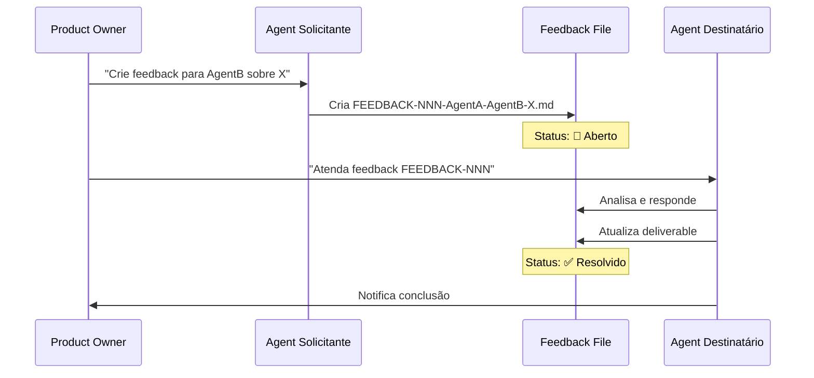

# FEEDBACK-FLOW-GUIDE.md

**Versão:** 1.0
**Data:** 2025-10-10

---

## 🎯 Objetivo

Documentar o fluxo completo de feedback entre agentes no DDD Workflow v1.0, com exemplos práticos e melhores práticas.

---

## 📋 Quando Usar Feedback

### ✅ Use Feedback Para:

1. **Correções em deliverables já entregues**
   - Erro em documentação
   - Bug em código implementado
   - Schema database com problema

2. **Esclarecimentos e dúvidas**
   - Requisito ambíguo
   - Dependência entre BCs não clara
   - Decisão técnica precisa validação

3. **Melhorias e sugestões**
   - Otimização de performance
   - Refatoração de código
   - Melhoria de UX

4. **Mudanças de escopo**
   - Novo requisito descoberto durante implementação
   - Restrição técnica não prevista
   - Dependência não documentada

### ❌ Não Use Feedback Para:

- **Workflow normal:** Agentes seguem ordem natural (SDA → UXD → DE → DBA → FE → QAE)
- **Entrega inicial:** Primeira versão de deliverable não precisa de feedback
- **Comunicação trivial:** Use comentários em código ou mensagens diretas

---

## 🔄 Fluxo de Feedback



---

## 📝 Formato do Feedback

### Nomenclatura

```
FEEDBACK-[NNN]-[FROM]-[TO]-[titulo-curto].md
```

**Componentes:**
- `[NNN]`: Número sequencial com 3 dígitos (001, 002, 003...)
- `[FROM]`: Sigla do agente solicitante (ou USER se Product Owner)
- `[TO]`: Sigla do agente destinatário
- `[titulo-curto]`: Título descritivo em kebab-case

**Exemplos:**
```
FEEDBACK-001-DE-SDA-adicionar-evento-strategy-adjusted.md
FEEDBACK-002-FE-UXD-modal-criar-estrategia-confuso.md
FEEDBACK-003-QAE-DE-aggregate-strategy-sem-validacao.md
FEEDBACK-004-USER-SDA-remover-bc-compliance.md
```

### Estrutura do Arquivo

Usar o template: `.agents/templates/07-feedback/FEEDBACK.template.md`

```markdown
# FEEDBACK-[NNN]-[FROM]-[TO]-[titulo]

**Solicitante:** [Agente ou Product Owner]
**Destinatário:** [Agente]
**Data Abertura:** [YYYY-MM-DD]
**Status:** 🔴 Aberto

## 📋 Tipo

- [x] Correção (deliverable já entregue precisa ajuste)
- [ ] Melhoria (sugestão de enhancement)
- [ ] Dúvida (esclarecimento necessário)
- [ ] Novo Requisito (mudança de escopo)

## 🎯 Contexto

**Deliverable Afetado:** [path/to/file.md]
**Epic Relacionado:** [Nome do épico se aplicável]
**Bounded Context:** [BC afetado]

## 📝 Descrição do Problema/Solicitação

[Descrição clara e concisa do que precisa ser ajustado/esclarecido]

## 💡 Sugestão de Solução (Opcional)

[Se o solicitante tem ideia de como resolver]

## 🔗 Referências

- Documento relacionado: [link]
- Issue GitHub: [link se houver]

---

## 💬 Resposta do Destinatário

**Data Resposta:** [YYYY-MM-DD]
**Status:** ✅ Resolvido

### Análise

[Análise do agente destinatário sobre o feedback]

### Ações Tomadas

- [x] Ação 1 realizada
- [x] Ação 2 realizada

### Arquivos Modificados

- `path/to/file1.md` - [descrição da mudança]
- `path/to/file2.cs` - [descrição da mudança]

### Observações

[Qualquer observação adicional ou impacto em outros componentes]
```

---

## 🎬 Exemplos Práticos

### Exemplo 1: DE solicita ajuste no Event Storming (SDA)

**Cenário:** Durante implementação do épico "Criar Estratégia", DE percebe que falta um evento "StrategyValidated" no Event Storming.

**Arquivo:** `FEEDBACK-001-DE-SDA-adicionar-evento-strategy-validated.md`

```markdown
# FEEDBACK-001-DE-SDA-adicionar-evento-strategy-validated

**Solicitante:** DE (Agente)
**Destinatário:** SDA (Agente)
**Data Abertura:** 2025-10-15
**Status:** 🔴 Aberto

## 📋 Tipo

- [x] Correção (deliverable já entregue precisa ajuste)
- [ ] Melhoria
- [ ] Dúvida
- [ ] Novo Requisito

## 🎯 Contexto

**Deliverable Afetado:** `00-doc-ddd/02-strategic-design/SDA-01-Event-Storming.md`
**Epic Relacionado:** Epic 1: Criar e Visualizar Estratégia
**Bounded Context:** Strategy Management

## 📝 Descrição do Problema/Solicitação

Durante implementação do aggregate `Strategy`, identifiquei que falta o evento de domínio **"StrategyValidated"** no Event Storming.

Este evento é necessário porque:
1. Após criar uma estratégia, ela passa por validação de business rules
2. Risk BC precisa ser notificado quando estratégia é validada (não apenas criada)
3. Diferencia estratégia criada (draft) de estratégia validada (ready)

**Fluxo atual documentado:**
```
[Usuário] -> (Criar Estratégia) -> [StrategyCreated]
```

**Fluxo real implementado:**
```
[Usuário] -> (Criar Estratégia) -> [StrategyCreated]
          -> (Validar Estratégia) -> [StrategyValidated] <- FALTANDO
```

## 💡 Sugestão de Solução

Adicionar ao Event Storming:

**Domain Event:** StrategyValidated
- **Trigger:** System (após validação automática)
- **Data:** { StrategyId, ValidationTimestamp, IsValid, ValidationErrors[] }
- **Subscribers:** Risk BC, Portfolio BC

## 🔗 Referências

- Aggregate Strategy: `02-backend/Strategy.Domain/Aggregates/Strategy.cs:87`
- Domain Event: `02-backend/Strategy.Domain/Events/StrategyValidated.cs`

---

## 💬 Resposta do Destinatário

**Data Resposta:** 2025-10-15
**Status:** ✅ Resolvido

### Análise

Concordo! A validação é uma etapa importante que não foi capturada inicialmente no Event Storming. Faz sentido ter evento separado porque:
- StrategyCreated = Draft state
- StrategyValidated = Ready state

### Ações Tomadas

- [x] Adicionado evento "StrategyValidated" ao Event Storming
- [x] Atualizado diagrama Mermaid
- [x] Documentado subscribers (Risk BC, Portfolio BC)
- [x] Adicionado command "ValidateStrategy" (estava implícito)

### Arquivos Modificados

- `00-doc-ddd/02-strategic-design/SDA-01-Event-Storming.md` - Adicionado evento e command

### Observações

Este evento impacta:
- **Risk BC:** Precisa aguardar StrategyValidated (não StrategyCreated)
- **DE:** Pode prosseguir com implementação do evento
- **QAE:** Adicionar teste de integração para validação cross-BC
```

---

### Exemplo 2: FE solicita esclarecimento de wireframe (UXD)

**Cenário:** FE está implementando modal de criação de estratégia e wireframe não especifica comportamento do botão "Adicionar Perna".

**Arquivo:** `FEEDBACK-002-FE-UXD-modal-adicionar-perna-comportamento.md`

```markdown
# FEEDBACK-002-FE-UXD-modal-adicionar-perna-comportamento

**Solicitante:** FE (Agente)
**Destinatário:** UXD (Agente)
**Data Abertura:** 2025-10-16
**Status:** 🔴 Aberto

## 📋 Tipo

- [ ] Correção
- [ ] Melhoria
- [x] Dúvida (esclarecimento necessário)
- [ ] Novo Requisito

## 🎯 Contexto

**Deliverable Afetado:** `00-doc-ddd/03-ux-design/UXD-02-Wireframes.md`
**Epic Relacionado:** Epic 1: Criar e Visualizar Estratégia
**Bounded Context:** Strategy Management (Frontend)

## 📝 Descrição do Problema/Solicitação

No wireframe "Modal: Criar Estratégia", há um botão [+ Adicionar Perna], mas não está claro:

1. **Onde a nova perna aparece?**
   - Inline no modal (cresce o modal)?
   - Em outro modal (nested modal)?
   - Em uma seção expansível?

2. **Limite de pernas:**
   - O botão desabilita após X pernas?
   - Mostra contador "2/4 pernas adicionadas"?

3. **Validação:**
   - Posso adicionar perna sem preencher a anterior?
   - Há validação real-time ou só no submit?

**Wireframe atual:**
```
+----------------------------------+
| Criar Estratégia                 |
+----------------------------------+
| Nome: [_____________]            |
| Tipo: [Dropdown]                 |
|                                  |
| [+ Adicionar Perna]              |
|                                  |
| [Cancelar]  [Criar]              |
+----------------------------------+
```

## 💡 Sugestão de Solução

Minha sugestão seria:
- Perna aparece inline abaixo do botão
- Limite de 4 pernas (conforme domain model)
- Validação real-time com indicador visual

## 🔗 Referências

- Domain Model: `Strategy.MaxLegs = 4`
- Component: `01-frontend/src/components/StrategyModal.tsx`

---

## 💬 Resposta do Destinatário

**Data Resposta:** 2025-10-16
**Status:** ✅ Resolvido

### Análise

Ótima observação! O wireframe estava muito high-level. Vou detalhar o comportamento.

### Ações Tomadas

- [x] Atualizado wireframe com fluxo de adicionar perna
- [x] Especificado limite de 4 pernas
- [x] Adicionado estados (empty, 1 perna, max pernas)
- [x] Documentado validação real-time

### Arquivos Modificados

- `00-doc-ddd/03-ux-design/UXD-02-Wireframes.md` - Seção "Modal: Criar Estratégia" expandida

### Observações

**Comportamento definido:**

1. **Adicionar perna:** Inline, aparece abaixo do botão
2. **Limite:** 4 pernas (botão desabilita, mostra "4/4 pernas")
3. **Validação:** Real-time (strike, expiration required)
4. **Remoção:** Botão {X} em cada perna

**Wireframe atualizado:**
```
+----------------------------------+
| Criar Estratégia                 |
+----------------------------------+
| Nome: [_____________]            |
| Tipo: [Dropdown]                 |
|                                  |
| 🔹 Perna 1          {X}          |
|   Strike: [___]                  |
|   Expiration: [___]              |
|                                  |
| 🔹 Perna 2          {X}          |
|   Strike: [___]                  |
|   Expiration: [___]              |
|                                  |
| [+ Adicionar Perna] (2/4)        |
|                                  |
| [Cancelar]  [Criar]              |
+----------------------------------+
```
```

---

### Exemplo 3: QAE solicita correção em Aggregate (DE)

**Cenário:** QAE encontrou bug durante teste: aggregate Strategy aceita perna com strike negativo.

**Arquivo:** `FEEDBACK-003-QAE-DE-strategy-aceita-strike-negativo.md`

```markdown
# FEEDBACK-003-QAE-DE-strategy-aceita-strike-negativo

**Solicitante:** QAE (Agente)
**Destinatário:** DE (Agente)
**Data Abertura:** 2025-10-18
**Status:** 🔴 Aberto

## 📋 Tipo

- [x] Correção (deliverable já entregue precisa ajuste)
- [ ] Melhoria
- [ ] Dúvida
- [ ] Novo Requisito

## 🎯 Contexto

**Deliverable Afetado:** `02-backend/Strategy.Domain/Aggregates/Strategy.cs`
**Epic Relacionado:** Epic 1: Criar e Visualizar Estratégia
**Bounded Context:** Strategy Management

## 📝 Descrição do Problema/Solicitação

Durante testes de boundary conditions, identifiquei que o aggregate `Strategy` aceita adicionar perna com **strike negativo**, o que é inválido.

**Teste que falhou:**
```csharp
[Fact]
public void AddLeg_WhenStrikeNegative_ShouldThrowException()
{
    var strategy = new Strategy(...);
    var leg = new StrategyLeg { Strike = -100 }; // Strike negativo!

    // Expected: DomainException
    // Actual: Leg adicionada sem erro
    Assert.Throws<DomainException>(() => strategy.AddLeg(leg));
}
```

**Problema:**
- Validação de strike só verifica `> 0` no Value Object `Strike`
- Mas `StrategyLeg` aceita construção sem validar invariante
- Aggregate não valida antes de adicionar leg

## 💡 Sugestão de Solução

Adicionar validação no método `Strategy.AddLeg()`:

```csharp
public void AddLeg(StrategyLeg leg)
{
    if (leg.Strike <= 0)
        throw new DomainException("Strike must be greater than zero");

    // ... resto da lógica
}
```

## 🔗 Referências

- Test: `tests/Strategy.Tests/StrategyTests.cs:125`
- Aggregate: `02-backend/Strategy.Domain/Aggregates/Strategy.cs:87`
- Value Object: `02-backend/Strategy.Domain/ValueObjects/Strike.cs`

---

## 💬 Resposta do Destinatário

**Data Resposta:** 2025-10-18
**Status:** ✅ Resolvido

### Análise

Bug confirmado! A validação estava no Value Object `Strike`, mas `StrategyLeg` pode ser construída sem passar pelo VO. Aggregate deve validar invariantes.

### Ações Tomadas

- [x] Adicionada validação em `Strategy.AddLeg()`
- [x] Validação movida para `StrategyLeg` constructor (melhor local)
- [x] Teste de QAE agora passa
- [x] Adicionados testes adicionais (strike zero, strike null)

### Arquivos Modificados

- `02-backend/Strategy.Domain/Entities/StrategyLeg.cs` - Validação no constructor
- `02-backend/Strategy.Domain/Aggregates/Strategy.cs` - Guard clause adicional
- `tests/Strategy.Tests/StrategyLegTests.cs` - Novos testes

### Observações

**Decisão técnica:**
Validação ficou em **dois níveis**:
1. `StrategyLeg` constructor: Valida dados básicos (strike > 0, expiration futuro)
2. `Strategy.AddLeg()`: Valida regras de negócio (max legs, leg duplicada)

Obrigado pelo catch! Regression test criado.
```

---

### Exemplo 4: User solicita evolução da especificação do PE (PE)

**Cenário:** User percebe que especificação do PE Agent evoluiu mas artefatos criados estão desalinhados.

**Arquivo:** `FEEDBACK-004-USER-PE-Agent-Specification-Evolution.md`

```markdown
# FEEDBACK-004-USER-PE-Agent-Specification-Evolution

**Solicitante:** User (Product Owner)
**Destinatário:** PE (Agent)
**Data Abertura:** 2025-01-27
**Status:** ✅ Resolvido

## 📋 Tipo

- [x] Correção (deliverable já entregue precisa ajuste)
- [x] Melhoria (sugestão de enhancement)

## 🎯 Contexto

**Deliverable Afetado:** PE-00-Environments-Setup.md
**Bounded Context:** Infra

## 📝 Descrição

O PE Agent passou por evolução significativa desde trabalho inicial:
- Traefik agora é integrado desde Discovery (não épicos posteriores)
- Estratégia .env multi-ambiente (dev/staging/production)
- Comandos docker-compose devem usar --env-file EXPLÍCITO
- Server setup documentation faltando

Necessário revisar todos os artefatos contra especificação atual.

## 💡 Sugestão de Solução

Fase 1: Auditoria (identificar gaps)
Fase 2: Correções (implementar)
Fase 3: Validação (quality checklist)

---

## 💬 Resposta do Destinatário

**Data Resposta:** 2025-01-28
**Status:** ✅ Resolvido

### Ações Tomadas

- [x] Adicionado letsencrypt-staging certificateResolver
- [x] docker-compose.staging.yml usa staging CA
- [x] .env.example com instruções multi-ambiente
- [x] PE-00: Comandos com --env-file .env.dev
- [x] PE-00: Seção Network Architecture (multi-server)
- [x] README: Comandos com --env-file explícito

### Arquivos Modificados

- PE-00-Environments-Setup.md (+250 linhas)
- 05-infra/configs/traefik.yml (2 certificateResolvers)
- 05-infra/configs/.env.example (instruções de uso)
- 05-infra/README.md (separação estratégico/operacional)
```

---

### Exemplo 5: GM solicita alinhamento com mudanças do PE (GM)

**Cenário:** FEEDBACK-004 (PE) implementou mudanças que impactam documentação do GM.

**Arquivo:** `FEEDBACK-005-GM-PE-Deployment-Commands-Alignment.md`

```markdown
# FEEDBACK-005-GM-PE-Deployment-Commands-Alignment

**Solicitante:** GM (Agent - auto-correção)
**Destinatário:** GM (Agent)
**Data Abertura:** 2025-01-28
**Status:** ✅ Resolvido

## 📋 Tipo

- [x] Correção (deliverable já entregue precisa ajuste)

## 🎯 Contexto

**Deliverable Afetado:** GM-00-GitHub-Setup.md
**Impacto:** FEEDBACK-004 (PE) mudou estratégia .env e comandos docker-compose

## 📝 Descrição

PE-00 agora documenta:
- .env.dev, .env.staging, .env.production (multi-ambiente)
- Comandos docker-compose com --env-file EXPLÍCITO
- Multi-server architecture (staging IP ≠ production IP)

GM-00 precisa integrar estas decisões na seção de deployment strategy.

---

## 💬 Resposta do Destinatário

**Status:** ✅ Resolvido

### Ações Tomadas

- [x] epic-deploy.sh: Comandos atualizados (linhas 244, 249)
- [x] GM-00: Nova seção "Deployment Strategy (PE-00 Integration)"
- [x] GM-00: Tabela .env files por ambiente
- [x] GM-00: Multi-server architecture reference

### Arquivos Modificados

- 03-github-manager/scripts/epic-deploy.sh (2 linhas)
- 00-doc-ddd/07-github-management/GM-00-GitHub-Setup.md (+60 linhas)
```

---

### Exemplo 6: DBA solicita estratégia multi-environment (DBA + PE)

**Cenário:** Análise de impacto dos FEEDBACKs 003, 004, 005 revela senhas hardcoded no Git.

**Arquivo:** `FEEDBACK-006-DBA-PE-Multi-Environment-Credentials.md`

```markdown
# FEEDBACK-006-DBA-PE-Multi-Environment-Credentials

**Solicitante:** DBA (Agent - análise de impacto)
**Destinatário:** DBA + PE (Agents)
**Data Abertura:** 2025-01-28
**Status:** ✅ Resolvido

## 📋 Tipo

- [x] Correção (deliverable já entregue precisa ajuste)

## 🎯 Contexto

**Deliverable Afetado:**
- 04-database/init-scripts/01-create-app-user.sql (hardcoded passwords)
- 04-database/README.md (falta multi-environment docs)

## 📝 Descrição

**Problema:** Init script tem senhas hardcoded apropriadas apenas para dev:
```sql
CREATE USER mytrader_app WITH PASSWORD 'app_dev_password_123';
```

**Riscos:**
- Mesma senha em TODOS os ambientes (dev, staging, production)
- Senha fraca em produção (viola LGPD/SOC2)
- Senha versionada no Git

**Não alinhado com FEEDBACK-004:** PE-00 estabeleceu .env.dev, .env.staging, .env.production

## 💡 Sugestão de Solução

**Opção 2 (ALTER USER - Mais Simples):**
- Init script mantém senhas default (dev only)
- Criar migration 002_update_production_passwords.sql
- Senhas passadas via psql -v (NUNCA commitadas)

---

## 💬 Resposta do Destinatário

**Status:** ✅ Resolvido

### Ações Tomadas

**DBA Agent:**
- [x] Migration 002 criada (ALTER USER approach)
- [x] README: Multi-Environment Password Strategy (+60 linhas)
- [x] README: Security Best Practices (+120 linhas)

**PE Agent:**
- [x] .env.example validado (DB_APP_PASSWORD, DB_READONLY_PASSWORD)

### Arquivos Modificados

- 04-database/migrations/002_update_production_passwords.sql (137 linhas)
- 04-database/README.md (+180 linhas)
- 05-infra/configs/.env.example (validado)

### Observações

**Security:**
- NEVER hardcode passwords in Git
- Password rotation: quarterly (prod), semi-annual (staging)
- Compliance: LGPD Art. 46, SOC2, ISO 27001
```

---

### Exemplo 7: User solicita análise de Docker Swarm (PE)

**Cenário:** User quer saber se infraestrutura atual é compatível com Docker Swarm e quando migrar.

**Arquivo:** `FEEDBACK-007-USER-PE-Docker-Swarm-Strategy.md`

```markdown
# FEEDBACK-007-USER-PE-Docker-Swarm-Strategy

**Solicitante:** User (Product Owner)
**Destinatário:** PE (Agent)
**Data Abertura:** 2025-10-28
**Status:** ✅ Resolvido

## 📋 Tipo

- [x] Melhoria (sugestão de enhancement)

## 🎯 Contexto

**Deliverable Afetado:** PE-00-Environments-Setup.md

## 📝 Descrição

Os artefatos do PE foram criados usando Docker Compose standalone. É necessário avaliar:

1. Compatibilidade com Docker Swarm
2. Viabilidade de migração (esforço, trade-offs)
3. Estratégia de Scaling (quando faz sentido migrar?)

### Contexto

Projeto em fase MVP com expectativa de crescimento. Prudente entender:
- Se infraestrutura atual suporta crescimento até certo ponto
- Quando será necessário migrar para orquestração
- Qual o custo (tempo/dinheiro) dessa migração futura

---

## 💬 Resposta do Destinatário

**Status:** ✅ Resolvido

### Análise Realizada

**1. Compose vs Swarm Compatibility:**
- 5 incompatibilidades identificadas (restart, container_name, depends_on, labels, bind mounts)
- Esforço: 1-2 semanas (4-8h conversão + 1-2 dias setup cluster)

**2. Decision Matrix:**
| Metric | Docker Compose | Managed Cloud | Kubernetes |
|--------|----------------|---------------|------------|
| Users | <10k | 10k-50k | >50k |
| SLA | 95-98% | 99%+ | 99.9%+ |
| Cost | $30-60/mo | $100-300/mo | $500+/mo |

**3. Migration Paths:**
- Path 1 (Recomendado): Managed Cloud (AWS ECS, Cloud Run, Azure CI)
- Path 2 (Opcional): Docker Swarm (não recomendado - pular)
- Path 3 (Enterprise): Kubernetes (>50k usuários)

### Ações Tomadas

- [x] PE-00: Seção "Estratégia de Escalabilidade e Orquestração" (+250 linhas)

### Decisão Final

✅ **MANTER Docker Compose** para MVP:
- Simplicidade operacional
- Custo adequado ($30-60/mês vs $150+/mês)
- Adequado para até 10-50k usuários
- Time pequeno (1-3 pessoas) consegue gerenciar

**Migrar quando:**
- >10k usuários simultâneos OU
- SLA 99%+ necessário OU
- Downtime frequente por saturação
```

---

### Exemplo 8: User solicita documentação de server setup (PE)

**Cenário:** FEEDBACK-008 estabeleceu estrutura de diretórios no servidor remoto, mas falta documentar COMO preparar o servidor.

**Arquivo:** `FEEDBACK-008-USER-PE-Remote-Server-Directory-Structure.md`

```markdown
# FEEDBACK-008-USER-PE-Remote-Server-Directory-Structure

**Solicitante:** User (Product Owner)
**Destinatário:** PE (Agent)
**Data Abertura:** 2025-10-28
**Status:** ✅ Resolvido (Follow-up completo)

## 📋 Tipo

- [x] Novo Requisito (mudança de escopo)

## 🎯 Contexto

**Deliverable Afetado:** PE-00-Environments-Setup.md

## 📝 Descrição

Estabelecer COMO criar servidores:
- Instalação mínima (Docker, firewall, etc)
- Criação de usuário do sistema
- Para Debian 12
- User com grupo de mesmo nome + grupo docker (secundário)
- Hostnames: myproject-stage (staging), myproject-prod (production)

### Lacunas Identificadas (Follow-up)

1. Hostname configuration
2. Docker Engine installation (Debian specific)
3. Firewall UFW configuration
4. Security hardening (fail2ban, SSH, NTP)
5. User/group creation
6. SSH keys configuration
7. Directory structure
8. .env creation

---

## 💬 Resposta do Destinatário

**Status:** ✅ Resolvido

### Ações Tomadas

- [x] PE-00: Seção "Setup Inicial do Servidor (Infraestrutura Base)" (+457 linhas)
  - Etapa 0: Hostname (myproject-stage, myproject-prod)
  - Etapa 1: Docker Engine (Debian 12 Bookworm)
  - Etapa 2: Firewall UFW (ports 22, 80, 443)
  - Etapa 3: Security hardening (fail2ban, SSH, NTP)
  - Etapa 4: User/group (myproject_app:docker)
  - Etapa 5: SSH keys
  - Etapa 6: Directory structure
  - Etapa 7: .env creation
  - Etapa 8: Verification checklist (11 items)

- [x] 05-infra/README.md: Pré-requisitos do Servidor (tabela 9 requirements)

### Arquivos Modificados

- PE-00-Environments-Setup.md (+457 linhas)
- 05-infra/README.md (prerequisites table)
```

---

### Exemplo 9: GM implementa remote deployment (GM)

**Cenário:** FEEDBACK-008 documentou server setup. Agora GM precisa implementar deploy remoto (não só documentar).

**Arquivo:** `FEEDBACK-009-GM-Implement-Remote-Deploy.md`

```markdown
# FEEDBACK-009-GM-Implement-Remote-Deploy

**Solicitante:** User (Product Owner)
**Destinatário:** GM (Agent)
**Data Abertura:** 2025-10-28
**Status:** ✅ Resolvido

## 📋 Tipo

- [x] Novo Requisito (mudança de escopo)

## 🎯 Contexto

**Deliverable Afetado:**
- 05-infra/scripts/deploy.sh
- .github/workflows/ (CD pipelines)

## 📝 Descrição

GM precisa implementar deploy remoto (não apenas documentar):

**Requisitos:**
1. deploy.sh deve detectar ambiente (local vs remoto)
2. Deployment remoto via SSH/SCP
3. Health checks com retry logic
4. CD pipelines: staging (auto), production (manual approval)
5. GitHub Secrets para SSH keys

**Referência:** FEEDBACK-008 (server preparado conforme PE-00)

---

## 💬 Resposta do Destinatário

**Status:** ✅ Resolvido

### Ações Tomadas

**deploy.sh (+177 linhas):**
- [x] check_ssh_connection()
- [x] remote_backup_database()
- [x] remote_health_check() (30 retries, 5s interval)
- [x] log_deployment_history()
- [x] deploy_remote() (main function)
- [x] main() detecta local vs remoto

**CD Pipelines:**
- [x] .github/workflows/cd-staging.yml (auto-deploy)
- [x] .github/workflows/cd-production.yml (manual approval)

### Arquivos Modificados

- 05-infra/scripts/deploy.sh (+177 linhas)
- .github/workflows/cd-staging.yml (38 linhas)
- .github/workflows/cd-production.yml (44 linhas)
- FEEDBACK-009 (resolution section)

### Key Features

**Remote Deploy:**
- Hostnames: myproject-stage, myproject-prod
- SSH/SCP for file transfer
- Remote docker compose execution
- HTTPS health checks (30 attempts, 5s interval)
- Deployment history logging

**CD Pipelines:**
- Staging: Auto-deploy on push to main
- Production: Manual approval (GitHub Environment protection)
- GitHub Secrets: SSH_PRIVATE_KEY_STAGING, SSH_PRIVATE_KEY_PRODUCTION
```

---

## 🔢 Numeração de Feedbacks

### Estratégia

- **Sequencial global:** FEEDBACK-001, FEEDBACK-002, FEEDBACK-003...
- **Não reinicia por épico:** Numeração única para todo o projeto
- **Padding de 3 dígitos:** Permite até 999 feedbacks

### Como Determinar Próximo Número

```powershell
# PowerShell
$lastFeedback = Get-ChildItem "00-doc-ddd/00-feedback" -Filter "FEEDBACK-*.md" |
    Sort-Object Name -Descending |
    Select-Object -First 1

if ($lastFeedback) {
    $lastNumber = [int]($lastFeedback.Name -replace 'FEEDBACK-(\d{3})-.*', '$1')
    $nextNumber = ($lastNumber + 1).ToString("000")
    Write-Host "Next feedback number: $nextNumber"
} else {
    Write-Host "Next feedback number: 001"
}
```

```bash
# Bash/Linux
last=$(ls 00-doc-ddd/00-feedback/FEEDBACK-*.md 2>/dev/null | sort -r | head -1)
if [ -n "$last" ]; then
    num=$(echo $last | grep -oP 'FEEDBACK-\K\d{3}')
    next=$(printf "%03d" $((10#$num + 1)))
else
    next="001"
fi
echo "Next feedback number: $next"
```

---

## 📊 Status do Feedback

### Estados Possíveis

- **🔴 Aberto:** Feedback criado, aguardando análise
- **🟡 Em Análise:** Destinatário está trabalhando
- **✅ Resolvido:** Ações completadas, deliverable atualizado
- **🚫 Rejeitado:** Feedback não será implementado (com justificativa)
- **⏸️ Bloqueado:** Aguardando dependência externa

### Transições

```
🔴 Aberto
    ↓
🟡 Em Análise
    ↓
✅ Resolvido  ou  🚫 Rejeitado  ou  ⏸️ Bloqueado
```

---

## ✅ Checklist: Criar Feedback

**Antes de criar:**
- [ ] Problema está claro e documentado
- [ ] Tentei resolver sozinho (se possível)
- [ ] Identifiquei agente correto
- [ ] Verifiquei se já existe feedback similar

**Ao criar:**
- [ ] Usei template correto
- [ ] Numeração sequencial correta
- [ ] Tipo de feedback selecionado
- [ ] Contexto completo (deliverable, epic, BC)
- [ ] Descrição clara e concisa
- [ ] Referências incluídas

**Depois de criar:**
- [ ] Arquivo salvo em `00-doc-ddd/00-feedback/`
- [ ] Notifiquei destinatário (via issue/mensagem)
- [ ] Aguardo resposta

---

## ✅ Checklist: Responder Feedback

**Ao receber:**
- [ ] Li e entendi o problema
- [ ] Atualizei status para 🟡 Em Análise
- [ ] Analisei impacto em outros componentes

**Ao resolver:**
- [ ] Implementei correção/melhoria
- [ ] Atualizei todos os deliverables afetados
- [ ] Testei mudanças
- [ ] Documentei ações tomadas no feedback
- [ ] Atualizei status para ✅ Resolvido
- [ ] Notifiquei solicitante

**Se rejeitar:**
- [ ] Justificativa clara no feedback
- [ ] Status atualizado para 🚫 Rejeitado
- [ ] Notifiquei solicitante com explicação

---

## 🔗 Referências

- **Template de Feedback:** `.agents/templates/07-feedback/FEEDBACK.template.md`
- **Workflow Guide:** `.agents/docs/00-Workflow-Guide.md`
- **Agents Overview:** `.agents/docs/01-Agents-Overview.md`

---

**Feedback Flow Guide Version:** 1.0
**Status:** Living Document
