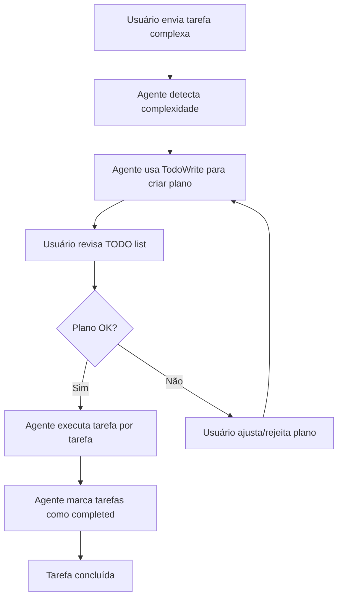

# Think Mode (Planning) - Guia de Uso

**Versão:** 1.0
**Data:** 2025-10-06
**Status:** Ativo

---

## 🎯 O Que É Think Mode?

**Think mode** (ou **planning mode**) é uma abordagem onde o agente AI **planeja ANTES de executar**, criando uma lista de tarefas (TODO list) que:

1. **Decompõe** a tarefa complexa em sub-tarefas menores
2. **Identifica** dependências entre tarefas
3. **Documenta** riscos e considerações
4. **Permite** que o usuário revise e aprove o plano antes da execução
5. **Rastreia** progresso em tempo real (pending → in_progress → completed)

---

## ✅ Por Que Usar Think Mode?

### **Benefícios:**

| Benefício | Descrição |
|-----------|-----------|
| 🔍 **Transparência** | Você vê EXATAMENTE o que será feito antes de acontecer |
| 🛡️ **Prevenção de Erros** | Previne erros custosos em infraestrutura e segurança |
| 📋 **Rastreabilidade** | Histórico completo de tarefas executadas |
| 🎯 **Foco** | Agente não se perde em tarefas complexas |
| 🔧 **Debugging** | Facilita identificar onde algo falhou |

### **Quando NÃO Usar:**

- ❌ Tarefas triviais (corrigir typo, ler 1 arquivo)
- ❌ Perguntas simples ("qual a versão do .NET?")
- ❌ Tarefas bem definidas e pequenas (<3 arquivos)

---

## 📊 Política de Think Mode por Agente

### **🔴 OBRIGATÓRIO (Agentes Críticos)**

| Agente | Quando Usar | Exemplo |
|--------|-------------|---------|
| **SDA** | Event Storming completo, múltiplos deliverables | "Faça Event Storming do sistema de e-commerce completo" |
| **PE** | Setup infraestrutura, mudanças em >5 recursos, DR | "Configure infraestrutura completa (Terraform + Docker Swarm + Prometheus)" |
| **SEC** | Threat Modeling, Pentest, Compliance, Incident Response | "Execute Threat Modeling STRIDE completo para todos BCs" |

### **🟡 RECOMENDADO**

| Agente | Quando Usar | Exemplo |
|--------|-------------|---------|
| **DE** | Implementação de >3 Aggregates, múltiplos Use Cases | "Implemente todo o BC de Pedidos (3 Aggregates + 8 Use Cases)" |
| **UXD** | Design completo de múltiplos flows | "Crie user flows e wireframes para todos os épicos" |

### **🟢 OPCIONAL**

| Agente | Quando Usar | Exemplo |
|--------|-------------|---------|
| **DBA** | Migrations complexas, múltiplos schemas | "Crie migrations para 5 BCs diferentes" |
| **FE** | Implementação de >5 componentes | "Implemente toda a Component Library (20 componentes)" |
| **QAE** | Suite completa de testes | "Crie strategy de testes completa (unit + integration + e2e)" |
| **GM** | Setup CI/CD completo | "Configure CI/CD completo (backend + frontend + security)" |

---

## 🔧 Como Funciona

### **Workflow do Think Mode:**



### **Exemplo Prático:**

#### **Sem Think Mode (Problemático):**
```
User: Configure a infraestrutura completa
Agent: [começa criando arquivos Terraform sem plano]
Agent: [cria docker-compose.yml]
Agent: [configura Prometheus]
User: "Espera! Eu queria usar Grafana Loki, não ELK Stack!"
Agent: [tem que refazer tudo]
```

#### **Com Think Mode (Correto):**
```
User: Configure a infraestrutura completa
Agent: Vou criar um plano usando TodoWrite...

TODO List:
1. Criar estrutura Terraform (VPC, Security Groups)
2. Configurar Docker Swarm (single-node MVP)
3. Setup Prometheus + Grafana
4. Setup Grafana Loki (logs)
5. Configurar Traefik (reverse proxy + SSL)
6. Criar docker-compose.yml
7. Documentar em PE-01-Infrastructure-Design.md

User: "OK, mas use Grafana Loki em vez de ELK"
Agent: "Já está no plano (item 4)! Vou executar..."
Agent: [executa item por item, marcando progresso]
```

---

## 🚀 Como Ativar Think Mode

### **Opção 1: Instruir Diretamente (Manual)**

Quando invocar um agente crítico (SDA, PE, SEC), adicione instrução:

```
"Execute em THINK MODE: crie TODO list antes de executar"
```

**Exemplo:**
```
User: "PE, configure infraestrutura completa. Execute em THINK MODE."
```

### **Opção 2: Agentes Detectam Automaticamente (Configurado nos XMLs)**

Os agentes **SDA, PE, SEC** já têm instrução embutida para usar think mode em tarefas complexas. Eles devem detectar automaticamente quando:

- Tarefa envolve >3 deliverables
- Múltiplos arquivos afetados (>5)
- Setup inicial de infraestrutura/segurança
- Event Storming completo
- Threat Modeling completo

---

## 📋 Triggers Automáticos de Think Mode

| Tipo de Tarefa | Exemplos | Think Mode? |
|----------------|----------|-------------|
| **Setup Completo** | "Configure infraestrutura completa", "Execute Event Storming" | ✅ SEMPRE |
| **Múltiplos Deliverables** | "Crie 5 documentos", "Implemente 3 BCs" | ✅ SEMPRE |
| **Mudanças Críticas** | "Configure DR", "Execute Pentest", "Implemente LGPD compliance" | ✅ SEMPRE |
| **Múltiplos Arquivos** | "Refatore 10 arquivos", "Crie 8 migrations" | ✅ SEMPRE |
| **Tarefa Simples** | "Leia arquivo X", "Corrija typo", "Liste arquivos" | ❌ NUNCA |
| **Pergunta** | "Qual a versão do .NET?", "Quantos BCs existem?" | ❌ NUNCA |

---

## 🎓 Boas Práticas

### **Para Usuários:**

1. **Seja específico na tarefa**
   - ❌ "Melhore a segurança"
   - ✅ "Execute Threat Modeling STRIDE para BC de Pagamentos"

2. **Revise o plano antes de aprovar**
   - Verifique se todas as sub-tarefas fazem sentido
   - Ajuste se algo estiver faltando ou errado

3. **Confie no processo**
   - Agentes críticos (SDA, PE, SEC) DEVEM usar think mode
   - Se não usarem, peça explicitamente

### **Para Agentes (Instruções nos XMLs):**

1. **Detecte complexidade**
   - >3 deliverables? Think mode
   - >5 arquivos? Think mode
   - Setup inicial? Think mode

2. **Use TodoWrite corretamente**
   ```
   TodoWrite:
   - Sub-tarefa 1 (status: pending)
   - Sub-tarefa 2 (status: pending)
   - Sub-tarefa 3 (status: pending)
   ```

3. **Marque progresso em tempo real**
   - ANTES de começar tarefa: `status: in_progress`
   - DEPOIS de terminar: `status: completed`

4. **Documente riscos**
   - Identifique dependências
   - Alerte sobre possíveis problemas

---

## 📚 Exemplos de Uso

### **Exemplo 1: SDA - Event Storming Completo**

```
User: "Execute Event Storming completo para sistema de e-commerce"

SDA: "Vou criar um plano usando TodoWrite..."

TODO List:
1. Identificar domain events principais (pending)
2. Agrupar events em Bounded Contexts candidatos (pending)
3. Definir relacionamentos entre BCs (pending)
4. Criar Context Map (pending)
5. Extrair Linguagem Ubíqua (pending)
6. Definir épicos por funcionalidade (pending)
7. Documentar em SDA-01-Event-Storming.md (pending)
8. Documentar em SDA-02-Context-Map.md (pending)
9. Documentar em SDA-03-Ubiquitous-Language.md (pending)

User: "OK, execute"

SDA: [marca tarefa 1 como in_progress]
SDA: "Identificando domain events... Encontrei: PedidoCriado, PagamentoConfirmado, PedidoEnviado..."
SDA: [marca tarefa 1 como completed]
SDA: [marca tarefa 2 como in_progress]
...
```

### **Exemplo 2: PE - Setup Infraestrutura**

```
User: "Configure infraestrutura completa (Terraform + Docker Swarm + Observability)"

PE: "Tarefas de infraestrutura são COMPLEXAS. Criando plano detalhado..."

TODO List:
1. Criar estrutura Terraform (main.tf, variables.tf, outputs.tf) (pending)
2. Configurar Contabo VPS L (€14.99/mês) (pending)
3. Inicializar Docker Swarm (single-node) (pending)
4. Configurar Traefik (reverse proxy + Let's Encrypt SSL) (pending)
5. Setup Prometheus + cAdvisor (pending)
6. Setup Grafana com dashboards básicos (pending)
7. Setup Grafana Loki + Promtail (logs) (pending)
8. Criar docker-compose.yml production-ready (pending)
9. Documentar em PE-01-Infrastructure-Design.md (pending)
10. Criar backup script (PostgreSQL daily backup) (pending)

User: "Perfeito! Execute"

PE: [executa item por item, documentando progresso]
```

### **Exemplo 3: SEC - Threat Modeling**

```
User: "Execute Threat Modeling completo (STRIDE) para todos os BCs"

SEC: "Segurança é CRÍTICA. Criando plano detalhado com análise de riscos..."

TODO List:
1. Ler SDA-02-Context-Map.md para identificar BCs (pending)
2. Criar Data Flow Diagram (DFD) do sistema (pending)
3. STRIDE analysis para BC Autenticação (pending)
4. STRIDE analysis para BC Pedidos (pending)
5. STRIDE analysis para BC Pagamentos (pending)
6. Identificar assets críticos (credentials, PII, payment data) (pending)
7. Criar attack trees para funcionalidades críticas (pending)
8. Documentar mitigation strategies (pending)
9. Priorizar ameaças (Impacto × Probabilidade) (pending)
10. Documentar em SEC-01-Threat-Model.md (pending)

User: "Ótimo, prossiga"

SEC: [executa análise completa com rastreabilidade total]
```

---

## 🔍 Troubleshooting

### **Problema: Agente não está usando think mode**

**Solução:**
```
User: "IMPORTANTE: Execute esta tarefa em THINK MODE. Crie TODO list antes de executar."
```

### **Problema: TODO list está muito genérica**

**Solução:**
```
User: "Detalhe mais o plano. Cada sub-tarefa deve ser específica e acionável."
```

### **Problema: Agente pulou etapas do TODO**

**Solução:**
```
User: "Você pulou a tarefa 3 do TODO. Por favor, execute todas as tarefas na ordem."
```

---

## 📖 Referências

- [workflow-config.json](../../workflow-config.json) - Seção `think-mode-policy`
- [10-SDA - Strategic Domain Analyst.xml](../10-SDA - Strategic Domain Analyst.xml) - Instrução think mode
- [80-PE - Platform Engineer.xml](../80-PE - Platform Engineer.xml) - Instrução think mode
- [90-SEC - Security Specialist.xml](../90-SEC - Security Specialist.xml) - Instrução think mode

---

## 📝 Changelog

| Versão | Data | Mudanças |
|--------|------|----------|
| 1.0 | 2025-10-06 | Criação inicial do guia |

---

**Última atualização:** 2025-10-06
**Autor:** DDD Workflow Team
