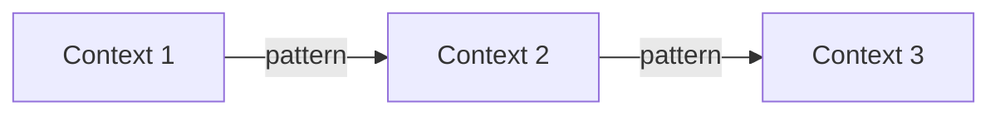

<!--
MARKDOWN FORMATTING:
- Use 2 spaces at end of line for compact line breaks (metadata)
- Use blank lines between sections for readability (content)
- Validate in Markdown preview before committing
-->

# SDA-02-Context-Map.md

**Projeto:** [PROJECT_NAME]  
**Data:** [YYYY-MM-DD]  

---

## 🗺️ Bounded Contexts Identificados

### Tabela de Classificação de Subdomínios

| Bounded Context | Classificação | Justificativa | Estratégia de Desenvolvimento |
|-----------------|---------------|---------------|-------------------------------|
| [Nome BC 1] | **Core** | Diferencial competitivo do negócio | Build internamente, maior investimento |
| [Nome BC 2] | **Supporting** | Necessário mas não diferencial | Build simples ou adaptar open-source |
| [Nome BC 3] | **Generic** | Commodity, disponível no mercado | Buy/SaaS (Auth0, SendGrid, etc) |

**Legenda:**  
- **Core Domain:** Diferencial competitivo, algoritmos proprietários, regras únicas de negócio
- **Supporting Domain:** Suporta o core mas não é diferencial (pode ser simples)
- **Generic Domain:** Commodity, pode comprar pronto ou usar biblioteca open-source

---

### 1. [Nome do BC] - [Core/Supporting/Generic]

**Responsabilidade:** [Descrição]  
**Complexidade:** [Alta/Média/Baixa]  
**Justificativa da Classificação:** [Por que Core/Supporting/Generic?]  
**Decisão Estratégica:** [Build/Buy/Adapt]  

### 2. [Outro BC]
...

---

## 🔗 Relacionamentos Entre Contextos

### Padrões de Integração DDD

#### 1. **Partnership** (Parceria)
Dois contexts colaboram mutuamente, dependência bidirecional.

#### 2. **Shared Kernel** (Núcleo Compartilhado)
⚠️ Usar com cautela: pequeno subset compartilhado, alto custo de coordenação.

#### 3. **Customer-Supplier** (Cliente-Fornecedor)
Upstream (supplier) fornece serviço, downstream (customer) consome. Customer pode negociar.

#### 4. **Conformist** (Conformista)
Downstream aceita modelo do upstream sem negociação (ex: API externa).

#### 5. **Anti-Corruption Layer (ACL)** ⭐
**CRUCIAL para sistemas externos!** Camada de tradução protege domínio interno.

**Quando usar ACL:**  
- Integração com APIs externas (brokers, pagamento, etc)
- Sistema legado com modelo diferente
- Proteção do domínio contra mudanças externas

**Exemplo:**  
```
[Broker API Externa] → [ACL Adapter] → [Market Data BC]
                           ↑
                    Traduz conceitos externos
                    para linguagem do domínio
```

#### 6. **Open Host Service (OHS)**
BC expõe API bem definida para múltiplos consumers.

#### 7. **Published Language**
Linguagem comum entre contexts (ex: FIX protocol no trading).

#### 8. **Separate Ways** (Caminhos Separados)
Sem integração, duplicação é mais barata que dependência.

#### 9. **Big Ball of Mud**
Sistema legado sem fronteiras claras (isolar e minimizar dependência).

---

### [BC1] ↔ [BC2]

**Padrão de Integração:** [Escolher da lista acima]  
**Direção:** [BC1] → [BC2] (upstream → downstream) ou bidirectional  
**Mecanismo:** [Domain Events | REST API | Message Queue | etc]  
**ACL Necessário?** [Sim/Não - Se Sim, especificar tradução]
**Descrição:** [Como interagem]  

**Exemplo de ACL (se aplicável):**  
```csharp
// ACL traduz modelo externo → modelo do domínio
public class BrokerApiAdapter : IMarketDataProvider
{
    public Price GetPrice(Symbol symbol)
    {
        var externalQuote = _brokerClient.GetQuote(symbol.Value);

        // Tradução: formato externo → domínio
        return new Price(
            Bid: new Money(externalQuote.bid_price),
            Ask: new Money(externalQuote.ask_price)
        );
    }
}
```

---

## 📊 Diagrama Context Map



---

## 🎯 Épicos Estratégicos

### Epic 1: [Nome da Funcionalidade]

**Bounded Contexts Envolvidos:**  
- [BC1]: [responsabilidade neste épico]
- [BC2]: [responsabilidade neste épico]

**Valor de Negócio:** [Alto/Médio/Baixo]  
**Prioridade:** [1, 2, 3...]  

### Epic 2: [Outra Funcionalidade]
...

---

## 📝 Notas

[Observações importantes sobre relacionamentos ou decisões]
