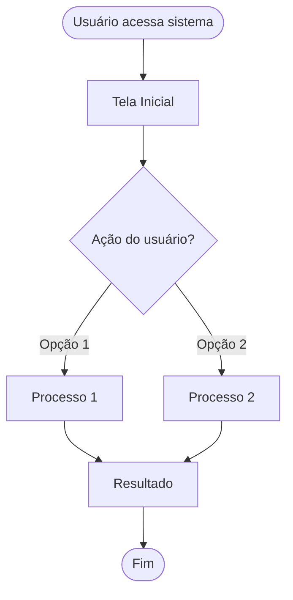
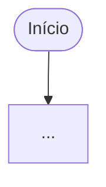

<!--
MARKDOWN FORMATTING:
- Use 2 spaces at end of line for compact line breaks (metadata)
- Use blank lines between sections for readability (content)
- Validate in Markdown preview before committing
-->

# UXD-01-User-Flows.md

**Projeto:** [PROJECT_NAME]
**Data:** [YYYY-MM-DD]
**Designer:** UXD Agent

---

## 🎯 Objetivo

Mapear as jornadas principais dos usuários através do sistema, identificando pontos de contato, decisões e integrações entre bounded contexts.

---

## 👥 Personas

### Persona 1: [Nome da Persona]

**Perfil:** [Descrição breve]
**Objetivos:** [O que quer alcançar]
**Pain Points:** [Problemas atuais]

### Persona 2: [Outra Persona]
...

---

## 🗺️ User Flows Principais

### Flow 1: [Nome da Jornada]

**Persona:** [Qual persona]
**Objetivo:** [O que o usuário quer fazer]
**Bounded Contexts Envolvidos:** [BC1, BC2, BC3]

**Fluxo:**

**Passos Detalhados:**

1. **[Passo 1]**
   - Screen: [Nome da tela]
   - Action: [Ação do usuário]
   - System: [O que sistema faz]
   - BC: [Bounded Context responsável]

2. **[Passo 2]**
   - ...

**Exceções/Erros:**
- [Cenário de erro 1] → [Tratamento]
- [Cenário de erro 2] → [Tratamento]

---

### Flow 2: [Outra Jornada]

**Persona:** [Qual persona]
**Objetivo:** [Objetivo]
**Bounded Contexts:** [BCs]

---

## 🔄 Integrações Entre Contextos

### Navegação: [BC1] → [BC2]

**Trigger:** [O que causa navegação]
**Dados Transferidos:** [Quais dados passam entre BCs]
**Estado Mantido:** [O que precisa ser preservado]

---

## 📱 Considerações de UX

### Mobile vs Desktop
- **Mobile:** [Adaptações necessárias]
- **Desktop:** [Funcionalidades específicas]

### Acessibilidade
- **Keyboard Navigation:** [Como navegar sem mouse]
- **Screen Readers:** [Suporte a leitores de tela]
- **WCAG Compliance:** [Nível A/AA/AAA]

---

## ✅ Validação

- [ ] Todos os user flows cobrem jornadas críticas
- [ ] Exceções e erros mapeados
- [ ] Navegação entre BCs clara
- [ ] Acessibilidade considerada
- [ ] Diagramas Mermaid renderizam corretamente
