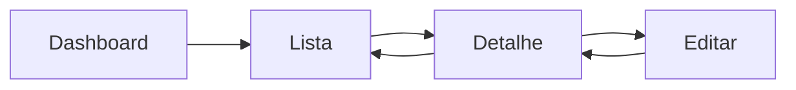

<!--
MARKDOWN FORMATTING:
- Use 2 spaces at end of line for compact line breaks (metadata)
- Use blank lines between sections for readability (content)
- Validate in Markdown preview before committing
-->

# UXD-02-Wireframes.md

**Projeto:** [PROJECT_NAME]
**Data:** [YYYY-MM-DD]
**Designer:** UXD Agent

---

## 🎯 Objetivo

Definir wireframes (low-fidelity) das telas críticas do sistema, especificando layout, componentes e funcionalidades.

---

## 📐 Convenções

**Símbolos:**
```
[Button]       - Botão clicável
[Input]        - Campo de entrada
[Dropdown]     - Seleção dropdown
[Table]        - Tabela de dados
[Card]         - Cartão de conteúdo
{Icon}         - Ícone
---            - Separador/linha
```

---

## 🖼️ Wireframes Por Bounded Context

### [BC Name] - Tela Principal

#### Tela: [Nome da Tela]

**URL/Route:** `/[route]`
**Acesso:** [Quem pode acessar]
**Objetivo:** [O que o usuário faz aqui]

**Layout:**

```
+----------------------------------------------------------+
|  Logo    [Navegação Principal]              {User Icon}  |
+----------------------------------------------------------+
|                                                          |
|  [Breadcrumb: Home > BC > Tela]                         |
|                                                          |
|  +---------------------------------------------------+   |
|  |  Título da Página                     [+ Novo]   |   |
|  +---------------------------------------------------+   |
|                                                          |
|  [Buscar...]                  [Filtro Dropdown]         |
|                                                          |
|  +---------------------------------------------------+   |
|  | Item 1                               [Ações...]  |   |
|  | Descrição breve                      {Edit} {Del}|   |
|  +---------------------------------------------------+   |
|  | Item 2                               [Ações...]  |   |
|  +---------------------------------------------------+   |
|                                                          |
|  [Paginação: 1 2 3 ... 10]                              |
|                                                          |
+----------------------------------------------------------+
|  Footer                                                  |
+----------------------------------------------------------+
```

**Componentes:**
1. **Header:** Logo + Navegação + User menu
2. **Breadcrumb:** Navegação contextual
3. **Action Bar:** Título + botões de ação primária
4. **Filters:** Busca + filtros dropdown
5. **Content List:** Lista/Grid de items
6. **Pagination:** Navegação entre páginas

**Interações:**
- Click em [+ Novo]: Abre modal/navegação para criar novo item
- Click em {Edit}: Edita item inline ou modal
- Click em {Del}: Confirmação + delete
- Buscar: Filtra lista em tempo real

**Estados:**
- Loading: Skeleton/spinner enquanto carrega
- Empty: Mensagem "Nenhum item encontrado"
- Error: Mensagem de erro clara

---

#### Tela: [Outra Tela do BC]

**URL/Route:** `/[route]`

```
+----------------------------------------------------------+
| [Wireframe ASCII art]                                    |
+----------------------------------------------------------+
```

---

### [Outro BC] - Telas

#### Tela: [Nome]
...

---

## 🔗 Navegação Entre Telas



---

## 📱 Responsividade

### Breakpoints

- **Mobile:** < 768px
- **Tablet:** 768px - 1024px
- **Desktop:** > 1024px

### Adaptações Mobile

**[Tela Principal]:**
- Navegação: Hamburger menu
- Tabela: Card list vertical
- Filtros: Bottom sheet

---

## 🎨 Design System Preview

### Cores Principais
- Primary: [#cor ou descrição]
- Secondary: [#cor]
- Success: [#cor]
- Error: [#cor]

### Typography
- Headings: [Font family, sizes]
- Body: [Font family, size]
- Code: [Monospace font]

### Spacing
- Base unit: [8px, 4px, etc]
- Margins/Padding: Múltiplos do base unit

---

## ✅ Validação

- [ ] Wireframes das telas críticas completos
- [ ] Layout responsivo considerado
- [ ] Componentes reutilizáveis identificados
- [ ] Navegação entre telas clara
- [ ] Estados (loading, empty, error) definidos
- [ ] Acessibilidade básica (keyboard nav, labels)
