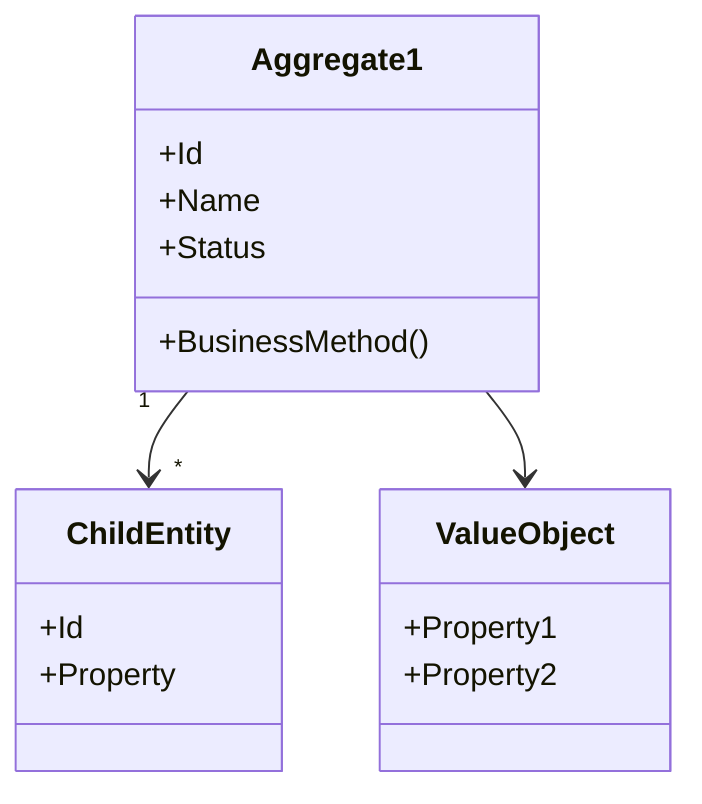

<!--
MARKDOWN FORMATTING:
- Use 2 spaces at end of line for compact line breaks (metadata)  
- Use blank lines between sections for readability (content)  
- Validate in Markdown preview before committing  
-->

# DE-01-[EpicName]-Tactical-Model.md

**Agent:** DE (Domain Engineer)
**Project:** [PROJECT_NAME]
**Date:** [YYYY-MM-DD]
**Epic:** [EPIC_NUMBER]: [EPIC_NAME]
**Phase:** Iteration
**Scope:** Tactical DDD model for epic-specific bounded contexts
**Version:** 1.0

---

## 🎯 Contexto do Épico

**Nome do Épico:** [Epic Name]  
**Bounded Contexts Envolvidos:** [BC1, BC2, BC3]  
**Objetivo de Negócio:** [O que este épico entrega de valor]  

---

## 🏗️ Modelo Tático por Bounded Context

### [BC Name 1]

#### Aggregates

##### 1. [Aggregate Name] (Aggregate Root)

**Responsabilidade:** [O que este aggregate gerencia]  

**Invariantes (Business Rules):**  
1. [Regra de negócio 1]
2. [Regra de negócio 2]

**Entities:**  

```csharp
// Aggregate Root
public class [AggregateName] : Entity<[AggregateId]>
{
    // Properties
    public [AggregateId] Id { get; private set; }
    public string Name { get; private set; }
    public [Status] Status { get; private set; }

    // Child entities
    private readonly List<[ChildEntity]> _items;
    public IReadOnlyList<[ChildEntity]> Items => _items.AsReadOnly();

    // Value Objects
    public [ValueObject] Details { get; private set; }

    // Domain Events
    private readonly List<IDomainEvent> _domainEvents = new();
    public IReadOnlyList<IDomainEvent> DomainEvents => _domainEvents.AsReadOnly();

    // Constructor
    public [AggregateName]([parameters])
    {
        // Validações
        // Inicialização
        // Raise domain event
        _domainEvents.Add(new [AggregateCreated](...));
    }

    // Business Methods
    public void [BusinessMethod]([parameters])
    {
        // Validar invariantes
        // Modificar estado
        // Raise domain event
        _domainEvents.Add(new [SomethingHappened](...));
    }
}

// Child Entity
public class [ChildEntity] : Entity<[ChildId]>
{
    public [ChildId] Id { get; private set; }
    public [Property] SomeProperty { get; private set; }

    // Constructor e métodos
}
```

**Value Objects:**  

```csharp
public record [ValueObjectName](
    [Type] Property1,
    [Type] Property2
)
{
    // Validações no constructor
    public [ValueObjectName]
    {
        if (Property1 == null) throw new ArgumentNullException(...);
        // Outras validações
    }
}
```

**Domain Events:**  

```csharp
public record [AggregateCreated](
    [AggregateId] AggregateId,
    DateTime OccurredAt
) : IDomainEvent;

public record [SomethingHappened](
    [AggregateId] AggregateId,
    [Data] RelevantData,
    DateTime OccurredAt
) : IDomainEvent;
```

---

#### ⚠️ Anti-Pattern: Modelo Anêmico

**EVITE:**  
```csharp
// ❌ MODELO ANÊMICO (apenas getters/setters, sem comportamento)
public class Order
{
    public OrderId Id { get; set; }  // setter público!
    public decimal Total { get; set; }
    public OrderStatus Status { get; set; }
}

// Lógica de negócio vazando para Application Layer
public class OrderService
{
    public void ApproveOrder(Order order)
    {
        order.Status = OrderStatus.Approved;  // regra de negócio fora do domínio!
        order.Total = order.Items.Sum(i => i.Price);
    }
}
```

**USE:**  
```csharp
// ✅ MODELO RICO (comportamento + invariantes)
public class Order
{
    public OrderId Id { get; private set; }  // setter privado!
    public decimal Total { get; private set; }
    public OrderStatus Status { get; private set; }

    // Comportamento rico com validações
    public void Approve(UserId approverId)
    {
        if (Status != OrderStatus.Pending)
            throw new DomainException("Only pending orders can be approved");

        if (Total <= 0)
            throw new DomainException("Cannot approve order with zero total");

        Status = OrderStatus.Approved;
        _domainEvents.Add(new OrderApproved(Id, approverId));
    }
}
```

**Princípio:** Aggregate = Dados + Comportamento + Invariantes (não apenas DTOs)  

---

#### Repository Interface

```csharp
public interface I[Aggregate]Repository
{
    Task<[Aggregate]> GetByIdAsync([AggregateId] id, CancellationToken ct);
    Task<IEnumerable<[Aggregate]>> GetActiveAsync([Criteria], CancellationToken ct);
    Task AddAsync([Aggregate] aggregate, CancellationToken ct);
    Task UpdateAsync([Aggregate] aggregate, CancellationToken ct);
    Task DeleteAsync([AggregateId] id, CancellationToken ct);
}
```

**Queries Esperadas pelo DBA:**  
1. `GetByIdAsync` → Index em Id (PK)
2. `GetActiveAsync` → Index em Status + [Criteria]

---

### [BC Name 2]

#### Aggregates

##### 2. [Another Aggregate]
...

---

## 🔄 Integração Entre Bounded Contexts

### [BC1] → [BC2] Integration

**Mecanismo:** Domain Events  
**Eventos Publicados por [BC1]:**  
- `[Event1]` → Consumido por [BC2] para [ação]  
- `[Event2]` → Consumido por [BC2] para [ação]  

**Fluxo:**  
```
[BC1: Aggregate]
    → raises [DomainEvent]
    → Event Bus
    → [BC2: EventHandler]
    → [BC2: Aggregate].ProcessEvent()
```

---

## 📋 Use Cases (Application Layer)

### Use Case 1: [Use Case Name]

**Actor:** [User/System]  
**Trigger:** [O que inicia este use case]  
**Bounded Context:** [BC]  

**Fluxo:**  

```csharp
public class [UseCaseName]Handler : IRequestHandler<[UseCaseCommand], [Result]>
{
    private readonly I[Aggregate]Repository _repository;
    private readonly IDomainEventDispatcher _eventDispatcher;

    public async Task<[Result]> Handle([UseCaseCommand] command, CancellationToken ct)
    {
        // 1. Validar comando

        // 2. Carregar aggregate (se necessário)
        var aggregate = await _repository.GetByIdAsync(command.Id, ct);

        // 3. Executar business method
        aggregate.[BusinessMethod](command.Parameters);

        // 4. Persistir
        await _repository.UpdateAsync(aggregate, ct);

        // 5. Dispatch domain events
        foreach (var @event in aggregate.DomainEvents)
        {
            await _eventDispatcher.DispatchAsync(@event, ct);
        }

        // 6. Retornar resultado
        return [Result].Success(aggregate);
    }
}
```

**Aggregates Envolvidos:**  
- [Aggregate1] (modify)  
- [Aggregate2] (read-only)  

**Domain Events Gerados:**  
- `[Event1]`  
- `[Event2]`  

---

### Use Case 2: [Another Use Case]
...

---

## 🗺️ Diagrama de Domínio (Opcional)



---

## 📊 Complexidade e Estimativas

| Bounded Context | Aggregates | Entities | Value Objects | Repositories | Complexity |
|-----------------|------------|----------|---------------|--------------|------------|
| [BC1] | 2 | 5 | 3 | 2 | Alta |
| [BC2] | 1 | 2 | 2 | 1 | Média |
| **Total** | **3** | **7** | **5** | **3** | **-** |

**Estimativa de Implementação:** [X] dias  

---

## ✅ Validação

- [ ] Aggregates definidos com invariantes claros  
- [ ] Boundaries dos aggregates respeitados (não muito grandes)  
- [ ] Domain Events identificados para integrações  
- [ ] Repository interfaces definidas  
- [ ] Use Cases mapeados  
- [ ] Validações de negócio no domínio (não na aplicação)  
- [ ] Nomenclatura consistente (PT → EN conforme padrões)  

---

## 📝 Notas de Implementação para DE

**Tecnologias:**  
- Framework: [.NET 8, etc]  
- ORM: [EF Core 8]  
- Event Bus: [MediatR, RabbitMQ, etc]  

**Estrutura de Pastas:**  
```
02-backend/src/
├── Domain/
│   ├── [BC1]/
│   │   ├── Aggregates/
│   │   ├── ValueObjects/
│   │   ├── DomainEvents/
│   │   └── Interfaces/
│   └── [BC2]/
├── Application/
│   ├── [BC1]/
│   │   ├── Commands/
│   │   ├── Queries/
│   │   └── Handlers/
└── Infrastructure/
    └── Persistence/
        ├── Repositories/
        └── Configurations/
```

---

## 🔗 Referências

- **SDA Context Map:** `00-doc-ddd/02-strategic-design/SDA-02-Context-Map.md`  
- **Ubiquitous Language:** `00-doc-ddd/02-strategic-design/SDA-03-Ubiquitous-Language.md`  
- **DBA Schema Review:** `00-doc-ddd/05-database-design/DBA-01-[EpicName]-Schema-Review.md` (após criar)  
