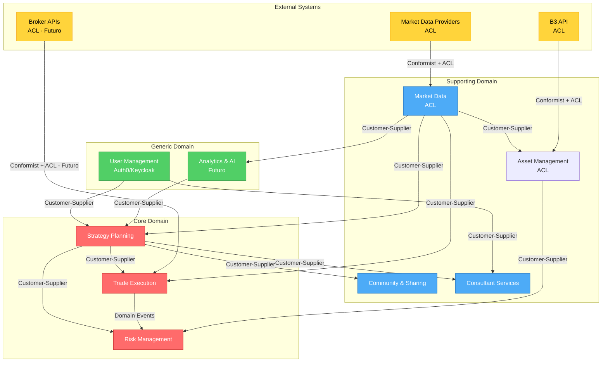

# SDA-02-Context-Map.md

**Projeto:** myTraderGEO
**Data:** 2025-10-06

---

## 🗺️ Bounded Contexts Identificados

### Tabela de Classificação de Subdomínios

| Bounded Context | Classificação | Justificativa | Estratégia de Desenvolvimento |
|-----------------|---------------|---------------|-------------------------------|
| **Strategy Planning** | **Core** | Diferencial competitivo - criação e análise de estratégias com opções | Build internamente, maior investimento |
| **Trade Execution** | **Core** | Diferencial - execução, monitoramento e ajuste de estratégias | Build internamente, maior investimento |
| **Risk Management** | **Core** | Diferencial - detecção de conflitos e gestão de risco personalizada | Build internamente, maior investimento |
| **Market Data** | **Supporting** | Necessário mas commodity - dados de mercado B3 | Adaptar providers existentes com ACL |
| **Asset Management** | **Supporting** | Suporte - gestão da carteira de ativos e integração com B3 | Build simples com ACL para B3 |
| **User Management** | **Generic** | Commodity - autenticação e autorização | Adaptar Auth0 ou Keycloak |
| **Community & Sharing** | **Supporting** | Suporte - chat e compartilhamento social | Build simples ou adaptar open-source |
| **Consultant Services** | **Supporting** | Suporte - gestão de carteira de clientes | Build simples |
| **Analytics & AI** | **Generic** | Futuro - backtesting e IA podem usar libs existentes | Adaptar bibliotecas ML/backtesting |

**Legenda:**
- **Core Domain:** Diferencial competitivo, algoritmos proprietários, regras únicas de negócio
- **Supporting Domain:** Suporta o core mas não é diferencial (pode ser simples)
- **Generic Domain:** Commodity, pode comprar pronto ou usar biblioteca open-source

---

### 1. Strategy Planning - **Core Domain**

**Responsabilidade:** Gestão do catálogo de estratégias (templates globais do sistema + templates pessoais do trader com controle de visibilidade), criação de estratégias baseadas em templates ou do zero, análise e simulação

**Complexidade:** Alta

**Justificativa da Classificação:** Diferencial competitivo principal - algoritmos de cálculo de margem, rentabilidade, gregas, detecção de padrões. Catálogo unificado com visibilidade (global/pessoal).

**Decisão Estratégica:** Build internamente (domínio rico, regras complexas)

**Entidades Principais:**
- `StrategyCatalog` (catálogo unificado com templates globais + pessoais)
- `StrategyTemplate` (template individual com visibilidade: global ou pessoal)
- `Strategy` (estratégia sendo criada/editada)

---

### 2. Trade Execution - **Core Domain**

**Responsabilidade:** Execução, monitoramento em tempo real e ajuste de estratégias ativas

**Complexidade:** Alta

**Justificativa da Classificação:** Diferencial - lógica de ajustes dinâmicos (rolagem, hedge, rebalanceamento) com cálculo automático de impactos

**Decisão Estratégica:** Build internamente (futuro: integração API corretoras via ACL)

---

### 3. Risk Management - **Core Domain**

**Responsabilidade:** Gestão de risco, detecção automática de conflitos, limites operacionais e alertas inteligentes

**Complexidade:** Alta

**Justificativa da Classificação:** Diferencial competitivo - algoritmo proprietário de detecção de conflitos entre estratégias, personalização de limites por perfil

**Decisão Estratégica:** Build internamente (lógica complexa de domínio)

---

### 4. Market Data - **Supporting Domain**

**Responsabilidade:** Sincronização de dados de mercado (preços, volatilidade, gregas) em tempo real ou batch

**Complexidade:** Média

**Justificativa da Classificação:** Necessário mas commodity - dados são externos (B3, provedores)

**Decisão Estratégica:** Adaptar providers com ACL (proteger domínio de mudanças externas)

---

### 5. Asset Management - **Supporting Domain**

**Responsabilidade:** Gestão da carteira de ativos (ações, índices, saldo) e carteira de opções (posições ativas) do trader, integração com B3, controle de garantias e custo médio

**Complexidade:** Média

**Justificativa da Classificação:** Suporte necessário mas não diferencial - sincronização com sistema externo (B3) para gestão de ativos e opções

**Decisão Estratégica:** Build simples com ACL para B3 API

**Entidades Principais:**
- `AssetPortfolio` (carteira de ativos - ações, índices, saldo)
- `OptionPortfolio` (carteira de opções - posições ativas)

---

### 6. User Management - **Generic Domain**

**Responsabilidade:** Cadastro, autenticação, autorização, gestão de roles e planos de assinatura

**Entidades Principais:**
- `User` (usuário do sistema)
- `Role` (papel: Trader, Administrator)
- `SubscriptionPlan` (plano: Básico, Pleno, Consultor)
- `RiskProfile` (perfil de risco: Conservador, Moderado, Agressivo)

**Roles:**
- **Trader**: Usuário que opera estratégias (pode ter qualquer plano)
- **Administrator**: Gestão do sistema, usuários, moderação de conteúdo, configurações globais

**Planos de Assinatura:**
- **Básico**: Funcionalidades essenciais
- **Pleno**: Funcionalidades avançadas (dados real-time, alertas avançados)
- **Consultor**: Todos recursos + ferramentas de consultoria

**Complexidade:** Baixa

**Justificativa da Classificação:** Commodity - autenticação/autorização são soluções prontas no mercado

**Decisão Estratégica:** Adaptar Auth0/Keycloak + custom attributes (role, subscription plan, risk profile)

---

### 7. Community & Sharing - **Supporting Domain**

**Responsabilidade:** Chat integrado, compartilhamento de estratégias, exportação para redes sociais

**Complexidade:** Baixa

**Justificativa da Classificação:** Suporte para engajamento mas não diferencial

**Decisão Estratégica:** Build simples (chat básico) ou adaptar libs open-source

---

### 8. Consultant Services - **Supporting Domain**

**Responsabilidade:** Gestão de carteira de clientes para consultores, compartilhamento e monetização de estratégias

**Complexidade:** Média

**Justificativa da Classificação:** Suporte para modelo de negócio consultor, regras simples

**Decisão Estratégica:** Build simples (CRUD + permissões)

---

### 9. Analytics & AI - **Generic Domain** (Futuro)

**Responsabilidade:** Backtesting, sugestões de IA, análise avançada de mercado

**Complexidade:** Alta (mas genérica)

**Justificativa da Classificação:** Funcionalidade avançada mas pode usar bibliotecas ML e backtesting existentes

**Decisão Estratégica:** Adaptar bibliotecas (pandas, scikit-learn, backtrader) + custom logic

---

## 🔗 Relacionamentos Entre Contextos

### Padrões de Integração DDD

**Legenda Rápida:**
- **Partnership:** Parceria bidirecional (raro, alto acoplamento)
- **Customer-Supplier:** Cliente consome serviço do fornecedor
- **ACL (Anti-Corruption Layer):** Camada de tradução (CRUCIAL para APIs externas)
- **Open Host Service:** BC expõe API pública para múltiplos consumers
- **Conformist:** Aceita modelo externo sem tradução
- **Shared Kernel:** Núcleo compartilhado (evitar)
- **Separate Ways:** Sem integração, duplicação preferível

---

### User Management ↔ Strategy Planning

**Padrão de Integração:** Customer-Supplier
**Direção:** User Management (upstream) → Strategy Planning (downstream)
**Mecanismo:** REST API ou eventos de domínio
**ACL Necessário?** Não (mesmo sistema, linguagem alinhada)
**Descrição:** Strategy Planning precisa de informações de usuário (role, risk profile, subscription plan) para validar limites e autorizar operações

---

### Strategy Planning → Market Data

**Padrão de Integração:** Customer-Supplier com ACL
**Direção:** Market Data (upstream) → Strategy Planning (downstream)
**Mecanismo:** REST API para dados de mercado
**ACL Necessário?** Sim - traduzir modelo externo (B3/providers) para domínio interno
**Descrição:** Strategy Planning consome preços, volatilidade e gregas para cálculos

**Exemplo de ACL:**
```typescript
// ACL traduz modelo externo B3 → modelo do domínio
interface IMarketDataProvider {
  getOptionPrice(symbol: string): Promise<OptionPrice>;
  getVolatility(symbol: string): Promise<number>;
}

class B3MarketDataAdapter implements IMarketDataProvider {
  async getOptionPrice(symbol: string): Promise<OptionPrice> {
    const externalQuote = await this.b3Client.getQuote(symbol);

    // Tradução: formato B3 → domínio
    return new OptionPrice({
      bid: new Money(externalQuote.precoCompra, 'BRL'),
      ask: new Money(externalQuote.precoVenda, 'BRL'),
      last: new Money(externalQuote.ultimoNegocio, 'BRL'),
      timestamp: new Date(externalQuote.dataHora)
    });
  }
}
```

---

### Strategy Planning → Risk Management

**Padrão de Integração:** Customer-Supplier
**Direção:** Risk Management (upstream) → Strategy Planning (downstream)
**Mecanismo:** Domain Events ou API síncrona
**ACL Necessário?** Não (BCs do mesmo sistema, linguagem alinhada)
**Descrição:** Strategy Planning solicita validação de risco ao criar/modificar estratégia. Risk Management retorna score de risco e detecta conflitos.

**Fluxo:**
```
[Strategy Planning]
    → envia StrategyCreatedEvent
    → [Risk Management] avalia risco
    → emite RiskAssessedEvent ou ConflictDetectedEvent
    → [Strategy Planning] atualiza estratégia
```

---

### Trade Execution → Strategy Planning

**Padrão de Integração:** Customer-Supplier
**Direção:** Strategy Planning (upstream) → Trade Execution (downstream)
**Mecanismo:** API de leitura (queries) + eventos
**ACL Necessário?** Não
**Descrição:** Trade Execution consome definições de estratégias do Strategy Planning para execução. Strategy Planning notifica mudanças via eventos.

---

### Trade Execution → Market Data

**Padrão de Integração:** Customer-Supplier com ACL
**Direção:** Market Data (upstream) → Trade Execution (downstream)
**Mecanismo:** Streaming (WebSocket) ou polling para dados em tempo real
**ACL Necessário?** Sim - mesma ACL usada por Strategy Planning
**Descrição:** Trade Execution consome dados de mercado em tempo real para cálculo de performance e P&L

---

### Trade Execution ↔ Broker API (Externa - Futuro)

**Padrão de Integração:** Conformist + ACL obrigatório
**Direção:** Datafeed Provider API (upstream) → Trade Execution (downstream)
**Mecanismo:** REST API ou FIX protocol
**ACL Necessário?** Sim - CRÍTICO para proteger domínio de mudanças em APIs externas
**Descrição:** Integração futura com datafeed providers (Nelógica, Cedro) que fornecem dados de mercado em tempo real e intermediam execução automática de ordens nas corretoras (Rico, XP, etc)

**ACL Crítico:**
```typescript
// ACL protege Trade Execution de mudanças na API do datafeed provider
class DatafeedProviderAdapter implements IOrderExecutor {
  async placeOrder(order: DomainOrder): Promise<ExecutionResult> {
    // Traduz ordem do domínio → formato do provider (Nelógica/Cedro)
    const providerOrder = {
      ticker: order.optionSymbol.value,
      side: order.position === Position.LONG ? 'BUY' : 'SELL',
      quantity: order.quantity,
      orderType: 'LIMIT',
      price: order.limitPrice.amount,
      broker: order.brokerAccount // Rico, XP, etc
    };

    const providerResponse = await this.datafeedClient.sendOrder(providerOrder);

    // Traduz resposta do provider → domínio
    return new ExecutionResult({
      orderId: new OrderId(providerResponse.order_id),
      status: this.mapProviderStatus(providerResponse.status),
      executedPrice: new Money(providerResponse.exec_price, 'BRL'),
      executedAt: new Date(providerResponse.timestamp)
    });
  }
}
```

---

### Asset Management → Market Data

**Padrão de Integração:** Customer-Supplier com ACL
**Direção:** Market Data (upstream) → Asset Management (downstream)
**Mecanismo:** REST API
**ACL Necessário?** Sim - mesma ACL compartilhada
**Descrição:** Asset Management consome preços atuais para valorização da carteira de ativos e garantias

---

### Asset Management ↔ B3 API (Externa)

**Padrão de Integração:** Conformist + ACL obrigatório
**Direção:** B3 API (upstream) → Asset Management (downstream)
**Mecanismo:** REST API B3
**ACL Necessário?** Sim - proteger de mudanças na API B3
**Descrição:** Sincronização da carteira de ativos, garantias e movimentações financeiras com B3

**ACL para B3:**
```typescript
class B3AssetAdapter implements IAssetPortfolioProvider {
  async getAssetPortfolio(userId: UserId): Promise<AssetPortfolio> {
    const b3Data = await this.b3Client.getCustomerPortfolio(userId.value);

    // Traduz modelo B3 → domínio
    const assets = b3Data.positions.map(pos => new Asset({
      ticker: new Ticker(pos.ticker),
      quantity: pos.qty,
      averagePrice: new Money(pos.avg_price, 'BRL')
    }));

    return new AssetPortfolio({ userId, assets });
  }
}
```

---

### Risk Management → Trade Execution

**Padrão de Integração:** Customer-Supplier
**Direção:** Trade Execution (upstream) → Risk Management (downstream)
**Mecanismo:** Domain Events
**ACL Necessário?** Não
**Descrição:** Risk Management escuta eventos de execução (PositionOpenedEvent, StrategyAdjustedEvent) para monitorar exposição total e disparar alertas

**Fluxo:**
```
[Trade Execution] emite PositionOpenedEvent
    ↓
[Risk Management] calcula exposição total
    ↓
Se limite excedido → emite MarginCallAlertEvent
    ↓
[Notification Service] envia alerta ao usuário
```

---

### Community & Sharing → Strategy Planning

**Padrão de Integração:** Customer-Supplier
**Direção:** Strategy Planning (upstream) → Community & Sharing (downstream)
**Mecanismo:** API de leitura (queries)
**ACL Necessário?** Não
**Descrição:** Community & Sharing consome estratégias públicas do catálogo para exibição e compartilhamento

---

### Consultant Services → User Management

**Padrão de Integração:** Customer-Supplier
**Direção:** User Management (upstream) → Consultant Services (downstream)
**Mecanismo:** REST API
**ACL Necessário?** Não
**Descrição:** Consultant Services valida permissões de consultor e acessa informações de clientes

---

### Consultant Services → Strategy Planning

**Padrão de Integração:** Customer-Supplier
**Direção:** Strategy Planning (upstream) → Consultant Services (downstream)
**Mecanismo:** API + eventos
**ACL Necessário?** Não
**Descrição:** Consultor cria/compartilha estratégias com clientes via Consultant Services, que coordena acesso ao Strategy Planning

---

### Analytics & AI → Market Data (Futuro)

**Padrão de Integração:** Customer-Supplier
**Direção:** Market Data (upstream) → Analytics & AI (downstream)
**Mecanismo:** Batch API para dados históricos
**ACL Necessário?** Sim
**Descrição:** Analytics & AI consome dados históricos para backtesting e treinamento de modelos

---

### Analytics & AI → Strategy Planning (Futuro)

**Padrão de Integração:** Customer-Supplier
**Direção:** Analytics & AI (upstream) → Strategy Planning (downstream)
**Mecanismo:** Domain Events ou API
**ACL Necessário?** Não
**Descrição:** Analytics & AI gera sugestões de ajustes ou novas estratégias que são publicadas como recomendações para Strategy Planning

---

## 📊 Diagrama Context Map



---

## 🎯 Épicos Estratégicos (Por Funcionalidade - Cross-BC)

### EPIC-01: Criação e Análise de Estratégias

**Bounded Contexts Envolvidos:**
- **User Management**: autenticação, perfil de risco
- **Strategy Planning**: catálogo (templates globais + pessoais), criação, cálculos
- **Market Data**: preços e volatilidade
- **Risk Management**: validação de limites

**Valor de Negócio:** Alto (funcionalidade core, diferencial competitivo)
**Prioridade:** 1 (MVP essencial)

**User Stories:**
- Como trader, quero ver templates do sistema (globais) e meus templates pessoais no catálogo
- Como trader, quero escolher um template do catálogo como base para criar estratégia
- Como trader, quero criar estratégias do zero ou baseadas em templates, definindo opções (strike, tipo, vencimento, quantidade)
- Como trader, quero ver cálculos automáticos de margem, rentabilidade e risco
- Como trader, quero opcionalmente salvar uma estratégia no catálogo como template pessoal para reutilizar depois

---

### EPIC-02: Execução e Monitoramento de Estratégias

**Bounded Contexts Envolvidos:**
- **Trade Execution**: ativação, monitoramento, ajustes
- **Strategy Planning**: definição de estratégias
- **Market Data**: dados em tempo real
- **Risk Management**: alertas e limites

**Valor de Negócio:** Alto (funcionalidade core)
**Prioridade:** 2 (após EPIC-01)

**User Stories:**
- Como trader, quero ativar estratégias e monitorar performance em tempo real
- Como trader, quero receber alertas de eventos críticos (margem, vencimento, conflitos)
- Como trader, quero executar ajustes (rolagem, hedge) com cálculo automático de margem

**Nota MVP**: No MVP, a execução de ordens é manual (trader registra ordens executadas na corretora Rico, XP, etc). Integração automática via datafeed providers (Nelógica, Cedro) que intermediam execução nas corretoras está planejada para versões futuras (ver EPIC-07)

---

### EPIC-03: Gestão de Risco e Controle Financeiro

**Bounded Contexts Envolvidos:**
- **Risk Management**: detecção de conflitos, limites
- **Asset Management**: integração B3, gestão de carteira de ativos e garantias
- **User Management**: perfil de risco
- **Trade Execution**: posições ativas

**Valor de Negócio:** Alto (diferencial competitivo - detecção automática de conflitos)
**Prioridade:** 3

**User Stories:**
- Como trader, quero definir limites operacionais baseados no meu perfil de risco
- Como trader, quero ser alertado sobre conflitos entre estratégias
- Como trader, quero sincronizar minha carteira de ativos e carteira de opções B3 para gestão de garantias

---

### EPIC-04: Comunidade e Compartilhamento

**Bounded Contexts Envolvidos:**
- **Community & Sharing**: chat, compartilhamento
- **Strategy Planning**: estratégias públicas
- **User Management**: usuários e permissões

**Valor de Negócio:** Médio (engajamento e retenção)
**Prioridade:** 4

**User Stories:**
- Como trader, quero conversar com outros usuários no chat integrado
- Como trader, quero compartilhar estratégias com a comunidade
- Como trader, quero exportar estratégias para Telegram/Twitter

---

### EPIC-05: Serviços para Consultores

**Bounded Contexts Envolvidos:**
- **Consultant Services**: gestão de clientes
- **Strategy Planning**: compartilhamento de estratégias
- **User Management**: plano consultor

**Valor de Negócio:** Médio (novo modelo de receita)
**Prioridade:** 5

**User Stories:**
- Como consultor, quero gerenciar uma carteira de clientes
- Como consultor, quero compartilhar e atribuir estratégias a clientes específicos
- Como consultor, quero rastrear estratégias compartilhadas

---

### EPIC-06: Backtesting e Análise Avançada (Futuro)

**Bounded Contexts Envolvidos:**
- **Analytics & AI**: backtesting, IA
- **Market Data**: dados históricos
- **Strategy Planning**: estratégias para teste

**Valor de Negócio:** Alto (diferencial futuro)
**Prioridade:** 6 (pós-MVP)

**User Stories:**
- Como trader, quero testar estratégias com dados históricos
- Como trader, quero receber sugestões de IA para ajustes de estratégias
- Como trader, quero ver métricas de backtesting (sharpe, max drawdown, win rate)

---

### EPIC-07: Execução Automatizada de Ordens (Futuro)

**Bounded Contexts Envolvidos:**
- **Trade Execution**: integração API corretoras
- **Strategy Planning**: estratégias para automação
- **Risk Management**: validação pré-execução

**Valor de Negócio:** Alto (diferencial futuro, automação completa)
**Prioridade:** 7 (pós-MVP)

**User Stories:**
- Como trader, quero executar ordens automaticamente via API da corretora
- Como trader, quero sincronização total com a B3 (ordens e posições)
- Como trader, quero validação automática de risco antes da execução

---

## 📝 Notas Importantes

### Estratégia de ACL (Anti-Corruption Layer)

**ACLs Críticos identificados:**
1. **Market Data ACL**: Traduz modelos B3/providers → domínio interno
2. **B3 Asset ACL**: Traduz API B3 → Asset Management (carteira de ativos)
3. **Broker API ACL (Futuro)**: Traduz APIs corretoras → Trade Execution

**Benefícios:**
- Protege domínio de mudanças em APIs externas
- Permite trocar providers sem impactar core domain
- Facilita testes (mock ACL em vez de APIs externas)

### Decisão: Market Data como BC Separado

Embora Market Data seja Supporting (commodity), mantemos como BC separado por:
1. **Alta carga**: tempo real para premium, polling para básico
2. **ACL compartilhado**: múltiplos BCs consomem via mesma camada de tradução
3. **Escalabilidade**: pode ser escalado independentemente
4. **Custo**: dados de mercado têm custo por chamada (otimização necessária)

### Integrações Futuras

**Roadmap de integrações:**
- **Fase 1 (MVP)**: Registro manual de ordens (corretoras Rico, XP, etc), dados de mercado via provider simples
- **Fase 2**: Integração B3 API para carteira e garantias
- **Fase 3**: Dados de mercado em tempo real via datafeed providers (Nelógica, Cedro) - WebSocket
- **Fase 4**: Execução automatizada via datafeed providers (Nelógica, Cedro) que intermediam ordens nas corretoras

### Recursos Externos para Cálculos

**Simulador B3:**
- URL: https://simulador.b3.com.br/
- Uso: Referência para cálculos de margem, risco e cenários
- Aplicação: Strategy Planning pode validar cálculos contra simulador B3
- Consideração: ACL necessário se integração direta for implementada

### Segurança e LGPD

**Dados sensíveis por BC:**
- **User Management**: email, senha, dados pessoais
- **Strategy Planning**: templates pessoais (propriedade intelectual)
- **Trade Execution**: ordens e posições reais
- **Asset Management**: carteira de ativos, carteira de opções, saldos e posições financeiras

**Ação:** SEC (Security Specialist) deve validar controles de acesso e criptografia por BC.
