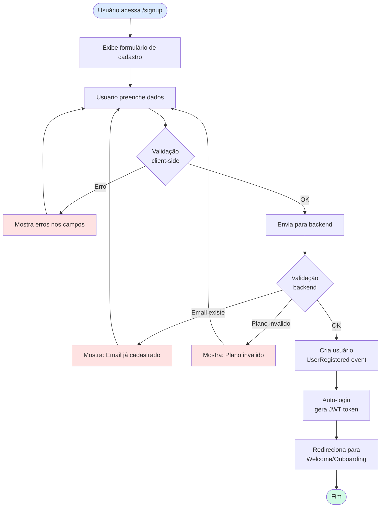
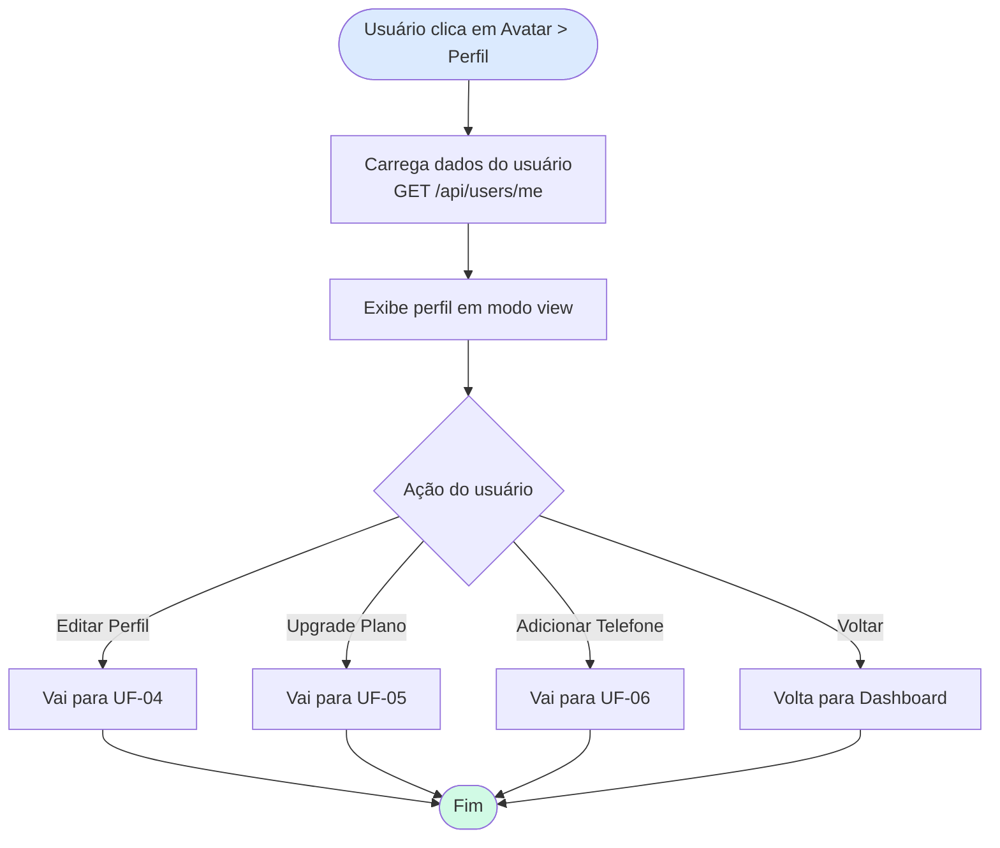
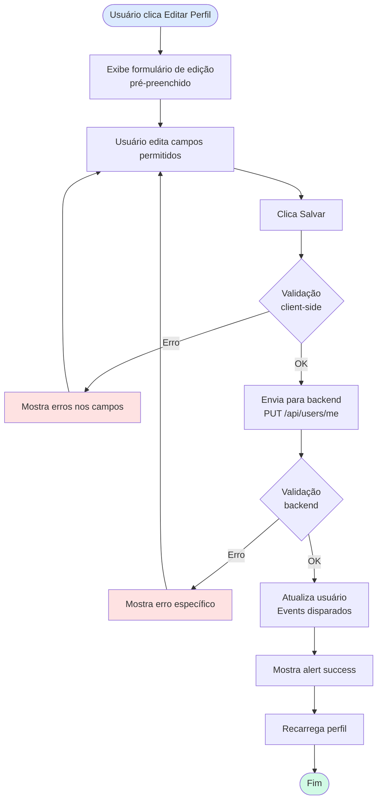

<!--
MARKDOWN FORMATTING:
- Use 2 spaces at end of line for compact line breaks (metadata)
- Use blank lines between sections for readability (content)
- Validate in Markdown preview before committing
-->

# UXD-01-EPIC-01-A - User Management: User Flows & Wireframes

**Agent:** UXD (User Experience Designer)  
**Project:** myTraderGEO  
**Date:** 2025-11-14  
**Epic:** EPIC-01-A: User Management  
**Phase:** Iteration  
**Scope:** User flows and wireframes for user management features  
**Version:** 1.0  

---

## 📋 Metadata

- **Epic Name:** User Management
- **Bounded Context:** User Management
- **Target Users:** Traders (new and existing), Administrators
- **Priority Flows:** Sign Up, Login, Profile Management, Plan Upgrade, Phone Verification
- **Design Foundation:** [UXD-00-Design-Foundations.md](UXD-00-Design-Foundations.md)
- **Domain Model:** [DE-01-EPIC-01-A-User-Management-Domain-Model.md](../04-tactical-design/DE-01-EPIC-01-A-User-Management-Domain-Model.md)

---

## 🎯 Objetivo

Desenhar os fluxos de usuário e wireframes para todas as funcionalidades de User Management (EPIC-01-A), garantindo uma experiência intuitiva, profissional e alinhada com o design system myTraderGEO.

**Escopo do Documento:**
- User flows completos (diagramas de fluxo)
- Wireframes detalhados (layouts de tela)
- Estados da UI (loading, error, success, empty)
- Validações e mensagens de erro
- Responsividade (desktop e mobile)

---

## 📊 Sumário de User Flows

| ID | User Flow | Prioridade | Usuário | Complexidade |
|----|-----------|------------|---------|--------------|
| UF-01 | Sign Up (Cadastro de Trader) | 🔴 Alta | Novo trader | Média |
| UF-02 | Login | 🔴 Alta | Todos os usuários | Baixa |
| UF-03 | View Profile | 🟡 Média | Trader logado | Baixa |
| UF-04 | Edit Profile | 🟡 Média | Trader logado | Média |
| UF-05 | Upgrade Subscription Plan | 🟡 Média | Trader logado | Média |
| UF-06 | Add Phone Number | 🟢 Baixa | Trader logado | Baixa |
| UF-07 | Verify Phone Number | 🟢 Baixa | Trader com telefone | Baixa |
| UF-08 | Change Phone Number | 🟢 Baixa | Trader com telefone | Média |

---

## 🔄 UF-01: Sign Up (Cadastro de Trader)

### User Flow Diagram



### Campos do Formulário

| Campo | Tipo | Validação Client-Side | Validação Backend | Obrigatório |
|-------|------|----------------------|-------------------|-------------|
| **Full Name** | Text | Min 2 chars, Max 100 chars | - | ✅ Sim |
| **Display Name** | Text | Min 2 chars, Max 30 chars | Único? (futuro) | ✅ Sim |
| **Email** | Email | Formato email válido | Email único no sistema | ✅ Sim |
| **Password** | Password | Min 8 chars, força: média/forte | BCrypt hash | ✅ Sim |
| **Confirm Password** | Password | Igual a Password | - | ✅ Sim |
| **Phone Number** | Tel | Formato internacional +XX XXXXXXXXXXX | PhoneNumber VO | ❌ Não (opcional) |
| **Risk Profile** | Select | Deve escolher uma opção | Enum válido | ✅ Sim |
| **Subscription Plan** | Radio | Deve escolher uma opção | Plano existe e ativo | ✅ Sim |
| **Billing Period** | Radio | Monthly ou Annual | Enum válido | ✅ Sim |
| **Terms & Conditions** | Checkbox | Deve aceitar | - | ✅ Sim |

### Estados da UI

**Loading:**
- Botão "Criar Conta" disabled
- Spinner dentro do botão
- Text: "Criando conta..."

**Success:**
- Alert success: "Conta criada com sucesso! Redirecionando..."
- Auto-redirect em 2s para /dashboard ou /welcome

**Error:**
- Alert error (top do form): Mensagem de erro geral
- Inline error (abaixo de cada campo): Erro específico
- Focus no primeiro campo com erro

### Mensagens de Erro

**Email já cadastrado:**
```
❌ Este email já está cadastrado.
   Você já tem uma conta? [Fazer login]
```

**Senha fraca:**
```
❌ Senha muito fraca.
   Use no mínimo 8 caracteres, incluindo letras maiúsculas, minúsculas e números.
```

**Plano inválido:**
```
❌ Plano de assinatura inválido ou inativo.
   Por favor, selecione um plano válido.
```

---

## 🔄 UF-02: Login

### User Flow Diagram

```mermaid
flowchart TD
    Start([Usuário acessa /login]) --> Form[Exibe formulário de login]
    Form --> Fill[Usuário preenche email e senha]
    Fill --> Submit[Envia para backend]
    Submit --> BackendValidate{Validação<br/>backend}

    BackendValidate -->|Email não existe| EmailError[Mostra: Email ou senha inválidos]
    EmailError --> Fill

    BackendValidate -->|Senha incorreta| PwdError[Mostra: Email ou senha inválidos]
    PwdError --> Fill

    BackendValidate -->|User suspended| StatusError[Mostra: Conta suspensa<br/>Entre em contato]
    StatusError --> End([Fim])

    BackendValidate -->|OK| RecordLogin[RecordLogin()<br/>UserLoggedIn event]
    RecordLogin --> GenerateJWT[Gera JWT token]
    GenerateJWT --> SaveLocal[Salva token no localStorage]
    SaveLocal --> Redirect[Redireciona para /dashboard]
    Redirect --> End2([Fim])

    style Start fill:#DBEAFE
    style End fill:#FEE2E2
    style End2 fill:#D1FAE5
    style EmailError fill:#FEE2E2
    style PwdError fill:#FEE2E2
    style StatusError fill:#FEE2E2
```

### Campos do Formulário

| Campo | Tipo | Validação | Obrigatório |
|-------|------|-----------|-------------|
| **Email** | Email | Formato email válido | ✅ Sim |
| **Password** | Password | Min 8 chars | ✅ Sim |
| **Remember Me** | Checkbox | - | ❌ Não |

### Estados da UI

**Loading:**
- Botão "Entrar" disabled
- Spinner dentro do botão
- Text: "Entrando..."

**Success:**
- Auto-redirect para /dashboard (sem mensagem, silencioso)

**Error:**
- Alert error: Mensagem de erro genérica (por segurança, não revelar se email existe)
- Focus no campo Email

### Mensagens de Erro

**Credenciais inválidas:**
```
❌ Email ou senha incorretos.
   [Esqueci minha senha]
```

**Conta suspensa:**
```
❌ Sua conta está suspensa.
   Entre em contato com o suporte: suporte@mytradergeo.com
```

**Muitas tentativas:**
```
❌ Muitas tentativas de login.
   Tente novamente em 15 minutos ou [redefina sua senha].
```

---

## 🔄 UF-03: View Profile

### User Flow Diagram



### Seções da Tela

**1. Informações Pessoais (Card)**
- Full Name (read-only)
- Display Name (read-only)
- Email (read-only)
- Phone Number (read-only ou "Não cadastrado" + botão "Adicionar")
- Phone Verified Badge (se telefone verificado)

**2. Perfil de Trading (Card)**
- Role (Trader badge)
- Risk Profile (badge colorido: Conservador/Moderado/Agressivo)
- Subscription Plan (badge com nome do plano)
- Billing Period (Monthly/Annual)
- Status (Active badge)

**3. Plan Details (Card)**
- Strategy Limit (número)
- Features (lista com checkmarks/x):
  - ✅ Realtime Data (ou ❌)
  - ✅ Advanced Alerts (ou ❌)
  - ✅ Consulting Tools (ou ❌)
  - ✅ Community Access (ou ❌)

**4. Plan Override (Card - se existir)**
- Banner warning: "Você tem acesso especial ativo"
- Reason: "Beta Tester" (exemplo)
- Expires At: "31/12/2025" (ou "Permanente")
- Overridden Features: Lista de features/limits modificados

**5. Ações (Footer)**
- Botão "Editar Perfil" (primary)
- Botão "Upgrade de Plano" (secondary)

---

## 🔄 UF-04: Edit Profile

### User Flow Diagram



### Campos Editáveis

| Campo | Editável? | Validação | Event Disparado |
|-------|-----------|-----------|-----------------|
| Full Name | ❌ Não | - | - |
| Display Name | ✅ Sim | Min 2, Max 30 chars | UserDisplayNameUpdated |
| Email | ❌ Não | - | - |
| Phone Number | ⚠️ Via UF-06/UF-08 | - | PhoneNumber* |
| Risk Profile | ✅ Sim | Enum válido | RiskProfileUpdated |
| Subscription Plan | ⚠️ Via UF-05 | - | UserPlanUpgraded |

### Estados da UI

**Loading:**
- Skeleton placeholders enquanto carrega dados
- Botão "Salvar" disabled

**Editing:**
- Campos habilitados (exceto read-only)
- Botão "Salvar" primary
- Botão "Cancelar" secondary

**Saving:**
- Botão "Salvar" disabled + spinner
- Text: "Salvando..."

**Success:**
- Alert success: "Perfil atualizado com sucesso!"
- Auto-dismiss em 3s

**Error:**
- Alert error: Mensagem de erro
- Inline errors nos campos específicos

### Mensagens de Erro

**DisplayName muito curto:**
```
❌ Nome de exibição deve ter entre 2 e 30 caracteres.
```

**Erro genérico:**
```
❌ Erro ao atualizar perfil. Tente novamente.
```

---

## 🔄 UF-05: Upgrade Subscription Plan

### User Flow Diagram

```mermaid
flowchart TD
    Start([Usuário clica Upgrade Plano]) --> Load[Carrega planos disponíveis<br/>GET /api/subscription-plans]
    Load --> Display[Exibe comparação de planos]
    Display --> Select[Usuário seleciona plano]
    Select --> Period[Usuário seleciona período<br/>Monthly ou Annual]
    Period --> Confirm[Exibe modal de confirmação<br/>com preço e features]
    Confirm --> Actions{Ação}

    Actions -->|Cancelar| Close[Fecha modal]
    Close --> Display

    Actions -->|Confirmar| Submit[Envia para backend<br/>PUT /api/users/me/subscription]
    Submit --> BackendValidate{Validação<br/>backend}

    BackendValidate -->|Erro| Error[Mostra erro]
    Error --> Display

    BackendValidate -->|OK| Update[UpgradeSubscriptionPlan()<br/>UserPlanUpgraded event]
    Update --> Success[Mostra alert success]
    Success --> Reload[Recarrega perfil]
    Reload --> End([Fim])

    style Start fill:#DBEAFE
    style End fill:#D1FAE5
    style Error fill:#FEE2E2
```

### Tela de Comparação de Planos

**Layout:** Cards lado a lado (desktop) ou stack vertical (mobile)

**Plano Card:**
- Nome do plano (Básico, Pleno, Consultor)
- Preço mensal destacado (R$ 0,00 / R$ 49,90 / R$ 149,90)
- Preço anual com desconto (badge: "Economize 20%")
- Lista de features (checkmarks):
  - Strategy Limit: 1 / Ilimitado / Ilimitado
  - Realtime Data: ❌ / ✅ / ✅
  - Advanced Alerts: ❌ / ✅ / ✅
  - Consulting Tools: ❌ / ❌ / ✅
  - Community Access: ✅ / ✅ / ✅
- Botão "Selecionar" (ou "Plano Atual" se já possui)

**Plano Atual:**
- Badge "Plano Atual" no card
- Botão disabled
- Outline em azul

**Plano Superior:**
- Botão primary "Upgrade"
- Badge "Recomendado" (se for Pleno)

**Plano Inferior:**
- Botão secondary "Downgrade" (future: não implementar no MVP)

### Modal de Confirmação

**Título:** "Confirmar Upgrade de Plano"

**Conteúdo:**
```
Você está fazendo upgrade de:
  Plano Básico (Mensal) → Plano Pleno (Anual)

Novo plano:
  • Plano Pleno
  • Cobrança anual: R$ 479,04 (economize 20%)
  • Próxima cobrança: 14/11/2026

Novos recursos incluídos:
  ✅ Estratégias ilimitadas
  ✅ Dados em tempo real
  ✅ Alertas avançados
  ✅ Acesso à comunidade

Deseja confirmar o upgrade?
```

**Ações:**
- Botão "Cancelar" (secondary)
- Botão "Confirmar Upgrade" (primary)

### Estados da UI

**Loading Plans:**
- Skeleton cards enquanto carrega planos

**Confirming:**
- Modal com overlay
- Botão "Confirmar" disabled + spinner durante processamento

**Success:**
- Alert success: "Plano atualizado com sucesso! Aproveite seus novos recursos."
- Modal fecha
- Perfil recarrega com novo plano

**Error:**
- Alert error no modal: Mensagem de erro específica
- Modal permanece aberto para tentar novamente

---

## 🔄 UF-06: Add Phone Number

### User Flow Diagram

```mermaid
flowchart TD
    Start([Usuário clica Adicionar Telefone]) --> Form[Exibe formulário de telefone]
    Form --> Fill[Usuário preenche número]
    Fill --> Submit[Clica Adicionar]
    Submit --> Validate{Validação<br/>client-side}

    Validate -->|Erro| ShowError[Mostra erro de formato]
    ShowError --> Fill

    Validate -->|OK| Backend[Envia para backend<br/>POST /api/users/me/phone]
    Backend --> BackendValidate{Validação<br/>backend}

    BackendValidate -->|Formato inválido| FormatError[Mostra erro de formato]
    FormatError --> Fill

    BackendValidate -->|OK| AddPhone[AddPhoneNumber()<br/>PhoneNumberAdded event]
    AddPhone --> SendSMS[Envia SMS com código]
    SendSMS --> VerifyFlow[Redireciona para UF-07<br/>Verify Phone]
    VerifyFlow --> End([Fim])

    style Start fill:#DBEAFE
    style End fill:#D1FAE5
    style ShowError fill:#FEE2E2
    style FormatError fill:#FEE2E2
```

### Campos do Formulário

| Campo | Tipo | Validação | Exemplo |
|-------|------|-----------|---------|
| **Country Code** | Select | Código válido | +55 (Brasil) |
| **Phone Number** | Tel | 8-15 dígitos | (11) 98765-4321 |

**Input Helper:**
- Mask automático no campo Phone Number baseado no país
- Exemplo: Brasil → (XX) XXXXX-XXXX
- Remover formatação antes de enviar para backend

### Estados da UI

**Adding:**
- Botão "Adicionar" disabled + spinner
- Text: "Adicionando..."

**Success:**
- Alert success: "Telefone adicionado! Enviamos um código de verificação via SMS."
- Auto-redirect para tela de verificação

**Error:**
- Alert error: Mensagem de erro específica
- Focus no campo Phone Number

### Mensagens de Erro

**Formato inválido:**
```
❌ Número de telefone inválido.
   Certifique-se de incluir DDD e número completo.
```

**Erro ao enviar SMS:**
```
❌ Erro ao enviar código de verificação.
   Verifique o número e tente novamente.
```

---

## 🔄 UF-07: Verify Phone Number

### User Flow Diagram

```mermaid
flowchart TD
    Start([Tela de verificação]) --> Display[Exibe campo de código<br/>+ número mascarado]
    Display --> Fill[Usuário digita código de 6 dígitos]
    Fill --> Submit[Clica Verificar]
    Submit --> Backend[Envia para backend<br/>POST /api/users/me/phone/verify]
    Backend --> Validate{Código<br/>válido?}

    Validate -->|Código inválido| CodeError[Mostra erro:<br/>Código inválido]
    CodeError --> Fill

    Validate -->|Código expirado| ExpiredError[Mostra erro:<br/>Código expirado]
    ExpiredError --> Resend[Botão Reenviar ativo]
    Resend --> Fill

    Validate -->|OK| Verify[VerifyPhoneNumber()<br/>PhoneNumberVerified event]
    Verify --> Success[Mostra alert success]
    Success --> Redirect[Redireciona para perfil]
    Redirect --> End([Fim])

    style Start fill:#DBEAFE
    style End fill:#D1FAE5
    style CodeError fill:#FEE2E2
    style ExpiredError fill:#FEE2E2
```

### Campos do Formulário

| Campo | Tipo | Validação |
|-------|------|-----------|
| **Verification Code** | Number | Exatamente 6 dígitos |

**UI Helpers:**
- Input auto-focus ao carregar página
- Auto-submit quando digitar 6º dígito (UX premium)
- Mostrar número mascarado: "Código enviado para +55 (11) 9****-4321"
- Timer de expiração: "Código expira em 4:35"

### Estados da UI

**Waiting:**
- Campo habilitado
- Botão "Verificar" primary
- Botão "Reenviar código" secondary (disabled por 60s após envio)

**Verifying:**
- Botão "Verificar" disabled + spinner
- Text: "Verificando..."

**Success:**
- Alert success: "Telefone verificado com sucesso!"
- Badge "Verificado" aparece no perfil

**Error:**
- Alert error: Mensagem de erro específica
- Clear campo de código
- Focus no campo

### Mensagens de Erro

**Código inválido:**
```
❌ Código de verificação inválido.
   Verifique o código e tente novamente.
```

**Código expirado:**
```
❌ Código expirado.
   Clique em "Reenviar código" para receber um novo.
```

**Muitas tentativas:**
```
❌ Muitas tentativas de verificação.
   Tente novamente em 15 minutos.
```

### Ações Secundárias

**Reenviar código:**
- Cooldown de 60 segundos entre reenvios
- Alert info: "Novo código enviado via SMS"
- Reset timer de expiração

**Alterar número:**
- Link "Número errado? Alterar"
- Volta para UF-06 (Add Phone) ou UF-08 (Change Phone)

---

## 🔄 UF-08: Change Phone Number

### User Flow Diagram

```mermaid
flowchart TD
    Start([Usuário clica Alterar Telefone]) --> Confirm[Exibe modal de confirmação<br/>Número atual será desvinculado]
    Confirm --> Actions{Ação}

    Actions -->|Cancelar| Close[Fecha modal]
    Close --> End([Fim])

    Actions -->|Confirmar| Form[Exibe formulário novo número]
    Form --> Fill[Usuário preenche novo número]
    Fill --> Submit[Clica Alterar]
    Submit --> Validate{Validação<br/>client-side}

    Validate -->|Erro| ShowError[Mostra erro]
    ShowError --> Fill

    Validate -->|OK| Backend[Envia para backend<br/>PUT /api/users/me/phone]
    Backend --> BackendValidate{Validação<br/>backend}

    BackendValidate -->|Erro| BackendError[Mostra erro]
    BackendError --> Fill

    BackendValidate -->|OK| Change[ChangePhoneNumber()<br/>PhoneNumberChanged event]
    Change --> Unverify[IsPhoneVerified = false]
    Unverify --> SendSMS[Envia SMS com código]
    SendSMS --> VerifyFlow[Redireciona para UF-07]
    VerifyFlow --> End2([Fim])

    style Start fill:#DBEAFE
    style End fill:#D1FAE5
    style End2 fill:#D1FAE5
    style ShowError fill:#FEE2E2
    style BackendError fill:#FEE2E2
```

### Modal de Confirmação

**Título:** "Alterar Número de Telefone"

**Conteúdo:**
```
⚠️ Atenção

Ao alterar o número de telefone:
  • Seu número atual (+55 11 98765-4321) será desvinculado
  • O novo número precisará ser verificado
  • Notificações por WhatsApp serão pausadas até verificação

Deseja continuar?
```

**Ações:**
- Botão "Cancelar" (secondary)
- Botão "Alterar Número" (warning/orange)

### Campos do Formulário

Igual a UF-06 (Add Phone Number):
- Country Code (select)
- Phone Number (tel)

### Estados da UI

Igual a UF-06, com diferenças:
- Botão text: "Alterar e Verificar"
- Success message: "Número alterado! Enviamos um código de verificação."

---

## 🖼️ Wireframes

### WF-01: Sign Up Page

```
┌────────────────────────────────────────────────────────────────────┐
│ myTraderGEO                                       [Já tem conta? Login] │
├────────────────────────────────────────────────────────────────────┤
│                                                                    │
│  ┌────────────────────────────────────────────────────────────┐  │
│  │                   Criar sua Conta                          │  │
│  │                                                            │  │
│  │  Nome Completo *                                          │  │
│  │  ┌──────────────────────────────────────────────────────┐ │  │
│  │  │ João da Silva                                         │ │  │
│  │  └──────────────────────────────────────────────────────┘ │  │
│  │                                                            │  │
│  │  Nome de Exibição *                                       │  │
│  │  ┌──────────────────────────────────────────────────────┐ │  │
│  │  │ João                                                  │ │  │
│  │  └──────────────────────────────────────────────────────┘ │  │
│  │  Este nome será exibido na comunidade                     │  │
│  │                                                            │  │
│  │  Email *                                                   │  │
│  │  ┌──────────────────────────────────────────────────────┐ │  │
│  │  │ joao@email.com                                        │ │  │
│  │  └──────────────────────────────────────────────────────┘ │  │
│  │                                                            │  │
│  │  Senha *                                                   │  │
│  │  ┌──────────────────────────────────────────────────────┐ │  │
│  │  │ ••••••••••                                            │ │  │
│  │  └──────────────────────────────────────────────────────┘ │  │
│  │  Mínimo 8 caracteres                                       │  │
│  │                                                            │  │
│  │  Confirmar Senha *                                         │  │
│  │  ┌──────────────────────────────────────────────────────┐ │  │
│  │  │ ••••••••••                                            │ │  │
│  │  └──────────────────────────────────────────────────────┘ │  │
│  │                                                            │  │
│  │  Telefone (opcional)                                       │  │
│  │  ┌────┬──────────────────────────────────────────────────┐ │  │
│  │  │+55│(11) 98765-4321                                    │ │  │
│  │  └────┴──────────────────────────────────────────────────┘ │  │
│  │  Para notificações via WhatsApp e recuperação de conta    │  │
│  │                                                            │  │
│  │  Perfil de Risco *                                         │  │
│  │  ┌──────────────────────────────────────────────────────┐ │  │
│  │  │ Conservador ▼                                         │ │  │
│  │  └──────────────────────────────────────────────────────┘ │  │
│  │                                                            │  │
│  │  ─────────────────────────────────────────────────────────│  │
│  │                                                            │  │
│  │  Escolha seu Plano *                                       │  │
│  │                                                            │  │
│  │  ┌───────────────┬───────────────┬───────────────┐       │  │
│  │  │   BÁSICO      │    PLENO      │  CONSULTOR    │       │  │
│  │  │  GRATUITO     │   R$ 49,90    │   R$ 149,90   │       │  │
│  │  │   /mês        │     /mês      │     /mês      │       │  │
│  │  ├───────────────┼───────────────┼───────────────┤       │  │
│  │  │ ○ Selecionar │ ○ Selecionar │ ○ Selecionar │       │  │
│  │  └───────────────┴───────────────┴───────────────┘       │  │
│  │                                                            │  │
│  │  Período de Cobrança (se plano pago) *                    │  │
│  │  ○ Mensal    ● Anual (economize 20%)                      │  │
│  │                                                            │  │
│  │  ☑ Li e aceito os Termos de Uso e Política de Privacidade│  │
│  │                                                            │  │
│  │  ┌──────────────────────────────────────────────────────┐ │  │
│  │  │           CRIAR CONTA                                 │ │  │
│  │  └──────────────────────────────────────────────────────┘ │  │
│  │                                                            │  │
│  └────────────────────────────────────────────────────────────┘  │
│                                                                    │
└────────────────────────────────────────────────────────────────────┘

Desktop: 600px max-width, centered
Mobile: Full width, stack vertically
```

**Componentes:**
- Logo: Top-left (link para homepage)
- Link "Já tem conta? Login": Top-right
- Form: Card centralizado, max-width 600px
- Inputs: Full-width dentro do card, height 44px
- Plan cards: Grid 3 columns (desktop) / stack (mobile)
- Button: Primary, full-width, height 48px

**Validações em Tempo Real:**
- Email: Mostrar checkmark verde se formato válido
- Senha: Barra de força (fraca/média/forte)
- Confirm Password: Checkmark verde se igual a Password

**States:**
- Error state: Border vermelho + ícone ⚠️ + mensagem abaixo do campo
- Loading: Botão disabled + spinner + text "Criando conta..."
- Success: Alert verde no topo + redirect

---

### WF-02: Login Page

```
┌────────────────────────────────────────────────────────────────────┐
│ myTraderGEO                                  [Não tem conta? Cadastre-se] │
├────────────────────────────────────────────────────────────────────┤
│                                                                    │
│                                                                    │
│          ┌────────────────────────────────────────────┐           │
│          │                                            │           │
│          │           Entrar no myTraderGEO           │           │
│          │                                            │           │
│          │  Email                                     │           │
│          │  ┌──────────────────────────────────────┐ │           │
│          │  │ seuemail@exemplo.com                 │ │           │
│          │  └──────────────────────────────────────┘ │           │
│          │                                            │           │
│          │  Senha                                     │           │
│          │  ┌──────────────────────────────────────┐ │           │
│          │  │ ••••••••••                           │ │           │
│          │  └──────────────────────────────────────┘ │           │
│          │                                            │           │
│          │  ☐ Lembrar-me                              │           │
│          │                    [Esqueci minha senha]   │           │
│          │                                            │           │
│          │  ┌──────────────────────────────────────┐ │           │
│          │  │           ENTRAR                     │ │           │
│          │  └──────────────────────────────────────┘ │           │
│          │                                            │           │
│          │  ─────────── ou entre com ────────────     │           │
│          │                                            │           │
│          │  ┌──────────────────────────────────────┐ │           │
│          │  │  G  Continuar com Google             │ │           │
│          │  └──────────────────────────────────────┘ │           │
│          │                                            │           │
│          └────────────────────────────────────────────┘           │
│                                                                    │
│                                                                    │
└────────────────────────────────────────────────────────────────────┘

Desktop: 400px max-width, centered vertically and horizontally
Mobile: Full width, padding 16px
```

**Componentes:**
- Logo: Top-center ou top-left
- Link "Não tem conta? Cadastre-se": Top-right
- Form: Card centralizado, max-width 400px
- Inputs: Full-width, height 44px
- Checkbox "Lembrar-me": Align left
- Link "Esqueci minha senha": Align right, inline com checkbox
- Button "Entrar": Primary, full-width, height 48px
- Divider: "ou entre com" centered
- Google button: Secondary (outline), full-width

**States:**
- Error: Alert vermelho acima do form com mensagem genérica
- Loading: Botão disabled + spinner + text "Entrando..."
- Success: Redirect silencioso (sem mensagem)

---

### WF-03: View Profile

```
┌────────────────────────────────────────────────────────────────────┐
│ [≡] myTraderGEO    Estratégias  Carteira  Comunidade  [🔔] [👤▼]  │
├────────────────────────────────────────────────────────────────────┤
│                                                                    │
│  Dashboard > Perfil                                                │
│                                                                    │
│  ┌────────────────────────────────────────────────────────────┐  │
│  │  INFORMAÇÕES PESSOAIS                      [✏️ Editar Perfil] │
│  ├────────────────────────────────────────────────────────────┤  │
│  │                                                            │  │
│  │  Nome Completo                                             │  │
│  │  João da Silva                                             │  │
│  │                                                            │  │
│  │  Nome de Exibição                                          │  │
│  │  João                                                      │  │
│  │                                                            │  │
│  │  Email                                                     │  │
│  │  joao@email.com                                            │  │
│  │                                                            │  │
│  │  Telefone                                                  │  │
│  │  +55 (11) 98765-4321  [✓ Verificado]  [Alterar]          │  │
│  │                                                            │  │
│  └────────────────────────────────────────────────────────────┘  │
│                                                                    │
│  ┌────────────────────────────────────────────────────────────┐  │
│  │  PERFIL DE TRADING                                         │  │
│  ├────────────────────────────────────────────────────────────┤  │
│  │                                                            │  │
│  │  Função               Perfil de Risco                      │  │
│  │  [Trader]             [Moderado]                           │  │
│  │                                                            │  │
│  │  Plano de Assinatura           Status                      │  │
│  │  [Plano Pleno] (Mensal)        [✓ Ativo]                   │  │
│  │                                                            │  │
│  └────────────────────────────────────────────────────────────┘  │
│                                                                    │
│  ┌────────────────────────────────────────────────────────────┐  │
│  │  DETALHES DO PLANO                      [Upgrade de Plano] │  │
│  ├────────────────────────────────────────────────────────────┤  │
│  │                                                            │  │
│  │  Limite de Estratégias: Ilimitado                          │  │
│  │                                                            │  │
│  │  Recursos Incluídos:                                       │  │
│  │    ✅ Dados em Tempo Real                                  │  │
│  │    ✅ Alertas Avançados                                    │  │
│  │    ❌ Ferramentas de Consultoria                           │  │
│  │    ✅ Acesso à Comunidade                                  │  │
│  │                                                            │  │
│  │  Próxima Cobrança: 14/12/2025 - R$ 49,90                  │  │
│  │                                                            │  │
│  └────────────────────────────────────────────────────────────┘  │
│                                                                    │
│  ┌────────────────────────────────────────────────────────────┐  │
│  │  ⚠️ ACESSO ESPECIAL ATIVO                                  │  │
│  ├────────────────────────────────────────────────────────────┤  │
│  │                                                            │  │
│  │  Motivo: Beta Tester                                       │  │
│  │  Expira em: 31/12/2025                                     │  │
│  │                                                            │  │
│  │  Benefícios Temporários:                                   │  │
│  │    • Limite de estratégias: 50 (em vez de ilimitado)      │  │
│  │    • Acesso a recursos experimentais                       │  │
│  │                                                            │  │
│  └────────────────────────────────────────────────────────────┘  │
│                                                                    │
└────────────────────────────────────────────────────────────────────┘

Desktop: Max-width 1024px, centered, 2-column layout (left 2/3, right 1/3)
Mobile: Stack vertically, full-width cards
```

**Componentes:**
- Top Nav: Logo + menu principal + notificações + avatar
- Breadcrumbs: Dashboard > Perfil
- Cards: White background, border, border-radius 8px, shadow-sm
- Card Headers: SemiBold 18px, flex justify-between (title + action button)
- Badges: Pill shape, colored backgrounds (green=active, blue=trader, yellow=moderado)
- Icons: 20px, inline with text
- Buttons: Icon buttons (small) para ações rápidas

**Conditional Rendering:**
- "Telefone": Se null, mostrar "Não cadastrado" + botão [Adicionar]
- "Plan Override Card": Só mostrar se PlanOverride != null
- Badge "Verificado": Só se IsPhoneVerified = true

---

### WF-04: Edit Profile (Modal ou Page)

```
┌────────────────────────────────────────────────────────────────────┐
│                    EDITAR PERFIL                        [✕]       │
├────────────────────────────────────────────────────────────────────┤
│                                                                    │
│  Nome Completo                                                     │
│  ┌──────────────────────────────────────────────────────────────┐ │
│  │ João da Silva                                                │ │
│  └──────────────────────────────────────────────────────────────┘ │
│  Não é possível alterar o nome completo.                          │
│                                                                    │
│  Nome de Exibição *                                                │
│  ┌──────────────────────────────────────────────────────────────┐ │
│  │ João                                                         │ │
│  └──────────────────────────────────────────────────────────────┘ │
│  Este nome será exibido na comunidade.                             │
│                                                                    │
│  Email                                                             │
│  ┌──────────────────────────────────────────────────────────────┐ │
│  │ joao@email.com                                               │ │
│  └──────────────────────────────────────────────────────────────┘ │
│  Para alterar o email, entre em contato com o suporte.            │
│                                                                    │
│  Perfil de Risco *                                                 │
│  ┌──────────────────────────────────────────────────────────────┐ │
│  │ Moderado ▼                                                   │ │
│  └──────────────────────────────────────────────────────────────┘ │
│  ⓘ Este perfil influencia recomendações e alertas de risco.       │
│                                                                    │
│  ─────────────────────────────────────────────────────────────────│
│                                                                    │
│                        [Cancelar]  [Salvar Alterações]            │
│                                                                    │
└────────────────────────────────────────────────────────────────────┘

Modal: 600px width, centered, overlay background rgba(0,0,0,0.6)
Page: Max-width 600px, centered
```

**Componentes:**
- Header: Title + Close button (X)
- Inputs read-only (disabled): Background gray, cursor not-allowed
- Inputs editable: Normal state
- Helper text: Gray, 12px, below input
- Info icon (ⓘ): Tooltip on hover
- Footer: Right-aligned buttons, gap 12px
- Buttons: Cancel (secondary), Save (primary)

**States:**
- Disabled fields: Full Name, Email (gray background)
- Enabled fields: Display Name, Risk Profile
- Loading: Botão "Salvar" disabled + spinner + text "Salvando..."
- Success: Alert verde no topo do modal + auto-close após 2s
- Error: Alert vermelho no topo + keep modal open

---

### WF-05: Upgrade Subscription Plan

```
┌────────────────────────────────────────────────────────────────────┐
│ [≡] myTraderGEO    Estratégias  Carteira  Comunidade  [🔔] [👤▼]  │
├────────────────────────────────────────────────────────────────────┤
│                                                                    │
│  Perfil > Upgrade de Plano                                         │
│                                                                    │
│  ┌────────────────────────────────────────────────────────────┐  │
│  │  Escolha o Plano Ideal para Você                           │  │
│  └────────────────────────────────────────────────────────────┘  │
│                                                                    │
│  Período:  ○ Mensal    ● Anual (economize 20%)                     │
│                                                                    │
│  ┌─────────────┬─────────────┬─────────────┐                      │
│  │   BÁSICO    │    PLENO    │  CONSULTOR  │                      │
│  │  [PLANO     │             │             │                      │
│  │   ATUAL]    │[Recomendado]│             │                      │
│  ├─────────────┼─────────────┼─────────────┤                      │
│  │  GRATUITO   │  R$ 49,90   │ R$ 149,90   │                      │
│  │    /mês     │    /mês     │    /mês     │                      │
│  │             │             │             │                      │
│  │ ou R$ 0/ano │ ou R$ 479   │ ou R$ 1.439 │                      │
│  │             │   (20% OFF) │  (20% OFF)  │                      │
│  ├─────────────┼─────────────┼─────────────┤                      │
│  │ Estratégias │ Estratégias │ Estratégias │                      │
│  │ 1 por vez   │ Ilimitadas  │ Ilimitadas  │                      │
│  │             │             │             │                      │
│  │ ❌ Dados    │ ✅ Dados    │ ✅ Dados    │                      │
│  │  Tempo Real │  Tempo Real │  Tempo Real │                      │
│  │             │             │             │                      │
│  │ ❌ Alertas  │ ✅ Alertas  │ ✅ Alertas  │                      │
│  │  Avançados  │  Avançados  │  Avançados  │                      │
│  │             │             │             │                      │
│  │ ❌ Ferram.  │ ❌ Ferram.  │ ✅ Ferram.  │                      │
│  │  Consultoria│  Consultoria│  Consultoria│                      │
│  │             │             │             │                      │
│  │ ✅ Comuni-  │ ✅ Comuni-  │ ✅ Comuni-  │                      │
│  │  dade       │  dade       │  dade       │                      │
│  ├─────────────┼─────────────┼─────────────┤                      │
│  │             │             │             │                      │
│  │ [Plano      │ [SELECIONAR]│ [SELECIONAR]│                      │
│  │  Atual]     │             │             │                      │
│  │ (disabled)  │ (primary)   │ (primary)   │                      │
│  │             │             │             │                      │
│  └─────────────┴─────────────┴─────────────┘                      │
│                                                                    │
│  ⓘ Você pode fazer downgrade ou cancelar a qualquer momento.      │
│                                                                    │
└────────────────────────────────────────────────────────────────────┘

Desktop: Grid 3 columns, equal width
Mobile: Stack vertically, swipe horizontal (carousel)
Tablet: 2 columns (Básico hidden or minimized)
```

**Componentes:**
- Toggle Period: Radio buttons (Mensal/Anual) - changes prices in all cards
- Plan Cards: Equal height, flex column, justify-between
- Badge "Plano Atual": Blue, top-right of card
- Badge "Recomendado": Purple/pink, top-right of card
- Features List: Checkmarks (green) / X marks (red), aligned left
- Buttons: Full-width inside card, margin-top auto
- Info banner: Bottom of page, light blue background

**Interaction:**
- Click "Selecionar": Opens confirmation modal
- Toggle Period: Re-renders cards with new prices

---

### WF-06: Upgrade Confirmation Modal

```
┌────────────────────────────────────────────────────────────────────┐
│                                                                    │
│     ┌──────────────────────────────────────────────────────┐     │
│     │  CONFIRMAR UPGRADE DE PLANO                    [✕]   │     │
│     ├──────────────────────────────────────────────────────┤     │
│     │                                                      │     │
│     │  Você está fazendo upgrade de:                       │     │
│     │    Plano Básico (Mensal) → Plano Pleno (Anual)      │     │
│     │                                                      │     │
│     │  ─────────────────────────────────────────────────  │     │
│     │                                                      │     │
│     │  Novo Plano                                          │     │
│     │    • Plano Pleno                                     │     │
│     │    • Cobrança anual: R$ 479,04 (economize 20%)      │     │
│     │    • Próxima cobrança: 14/11/2026                    │     │
│     │                                                      │     │
│     │  Novos recursos incluídos:                           │     │
│     │    ✅ Estratégias ilimitadas                         │     │
│     │    ✅ Dados em tempo real                            │     │
│     │    ✅ Alertas avançados                              │     │
│     │    ✅ Acesso à comunidade                            │     │
│     │                                                      │     │
│     │  ─────────────────────────────────────────────────  │     │
│     │                                                      │     │
│     │  ⓘ Você será cobrado R$ 479,04 hoje. O valor será   │     │
│     │    creditado proporcionalmente ao plano anterior.    │     │
│     │                                                      │     │
│     │  ─────────────────────────────────────────────────  │     │
│     │                                                      │     │
│     │                   [Cancelar]  [Confirmar Upgrade]   │     │
│     │                                                      │     │
│     └──────────────────────────────────────────────────────┘     │
│                                                                    │
└────────────────────────────────────────────────────────────────────┘

Modal: 500px width, centered, overlay rgba(0,0,0,0.6)
```

**Componentes:**
- Header: Title + Close button
- Summary: Old plan → New plan (bold, highlight)
- Divider: Thin line, gray
- Details: List with bullet points
- Features: Checkmarks (green), list
- Info banner: Light blue background, info icon
- Footer: Buttons right-aligned, gap 12px

**States:**
- Confirming: Botão "Confirmar" disabled + spinner + text "Processando..."
- Success: Modal closes + alert success na página de perfil
- Error: Alert error dentro do modal + keep modal open

---

### WF-07: Add Phone Number

```
┌────────────────────────────────────────────────────────────────────┐
│                    ADICIONAR TELEFONE                     [✕]     │
├────────────────────────────────────────────────────────────────────┤
│                                                                    │
│  Digite seu número de telefone para receber notificações via      │
│  WhatsApp e usar como método de recuperação de conta.             │
│                                                                    │
│  Código do País *                                                  │
│  ┌──────────────────────────────────────────────────────────────┐ │
│  │ +55 (Brasil) ▼                                               │ │
│  └──────────────────────────────────────────────────────────────┘ │
│                                                                    │
│  Número de Telefone *                                              │
│  ┌──────────────────────────────────────────────────────────────┐ │
│  │ (11) 98765-4321                                              │ │
│  └──────────────────────────────────────────────────────────────┘ │
│  Incluir DDD e número completo                                     │
│                                                                    │
│  ⓘ Um código de verificação será enviado via SMS após adicionar.  │
│                                                                    │
│  ─────────────────────────────────────────────────────────────────│
│                                                                    │
│                          [Cancelar]  [Adicionar]                  │
│                                                                    │
└────────────────────────────────────────────────────────────────────┘

Modal: 500px width, centered
Mobile: Full-screen modal
```

**Componentes:**
- Description: Gray text, 14px, margin-bottom 20px
- Country Code: Select dropdown, width 200px (desktop) or full-width (mobile)
- Phone Number: Tel input, auto-format based on country (mask)
- Helper text: Below input, gray
- Info banner: Light blue, info icon, margin-bottom 20px
- Footer: Buttons right-aligned

**Input Masks by Country:**
- Brasil (+55): (XX) XXXXX-XXXX
- EUA (+1): (XXX) XXX-XXXX
- Outros: XXXXXXXXXXX (generic)

**States:**
- Adding: Botão "Adicionar" disabled + spinner + text "Adicionando..."
- Success: Modal closes + redirect to Verify Phone screen
- Error: Alert error dentro do modal + keep modal open + focus on phone input

---

### WF-08: Verify Phone Number

```
┌────────────────────────────────────────────────────────────────────┐
│ myTraderGEO                                                        │
├────────────────────────────────────────────────────────────────────┤
│                                                                    │
│                                                                    │
│          ┌────────────────────────────────────────────┐           │
│          │                                            │           │
│          │       Verificar Número de Telefone        │           │
│          │                                            │           │
│          │  Enviamos um código de 6 dígitos para:    │           │
│          │  +55 (11) 9****-4321                       │           │
│          │                                            │           │
│          │  Código de Verificação                     │           │
│          │  ┌──┬──┬──┬──┬──┬──┐                      │           │
│          │  │ 1│ 2│ 3│ 4│ 5│ 6│                      │           │
│          │  └──┴──┴──┴──┴──┴──┘                      │           │
│          │                                            │           │
│          │  Código expira em: 4:35                    │           │
│          │                                            │           │
│          │  ┌──────────────────────────────────────┐ │           │
│          │  │           VERIFICAR                  │ │           │
│          │  └──────────────────────────────────────┘ │           │
│          │                                            │           │
│          │  Não recebeu o código?                     │           │
│          │  [Reenviar código] (disponível em 0:48)   │           │
│          │                                            │           │
│          │  Número errado?                            │           │
│          │  [Alterar número]                          │           │
│          │                                            │           │
│          └────────────────────────────────────────────┘           │
│                                                                    │
│                                                                    │
└────────────────────────────────────────────────────────────────────┘

Desktop: 450px width, centered vertically and horizontally
Mobile: Full-width, padding 16px
```

**Componentes:**
- Masked Phone: Show partial number (9****-4321) for security
- Code Input: 6 individual boxes, auto-focus, auto-submit on 6th digit
- Timer: Countdown (MM:SS format), update every second
- Verify Button: Primary, full-width
- Resend Link: Secondary button or link, disabled during cooldown
- Change Number Link: Text link, small

**Code Input Behavior:**
- Auto-focus on first box when page loads
- Auto-advance to next box on digit input
- Auto-submit when 6th digit entered (no need to click button)
- Backspace: Clear current box and move to previous
- Paste: Support paste 6-digit code (split into boxes)

**States:**
- Verifying: Botão "Verificar" disabled + spinner + text "Verificando..."
- Success: Alert success + redirect to profile with success message
- Error: Alert error + clear code input + focus on first box
- Resend Cooldown: Link disabled with countdown "Reenviar (0:48)"
- Resend Available: Link enabled "Reenviar código"

**Timer Behavior:**
- Start at 5:00 (5 minutes)
- Countdown to 0:00
- On expire: Show alert "Código expirado" + enable "Reenviar" immediately

---

### WF-09: Change Phone Number (Modal)

```
┌────────────────────────────────────────────────────────────────────┐
│                                                                    │
│     ┌──────────────────────────────────────────────────────┐     │
│     │  ALTERAR NÚMERO DE TELEFONE                    [✕]   │     │
│     ├──────────────────────────────────────────────────────┤     │
│     │                                                      │     │
│     │  ⚠️ Atenção                                          │     │
│     │                                                      │     │
│     │  Ao alterar o número de telefone:                   │     │
│     │    • Seu número atual será desvinculado             │     │
│     │      (+55 11 98765-4321)                             │     │
│     │    • O novo número precisará ser verificado          │     │
│     │    • Notificações por WhatsApp serão pausadas        │     │
│     │      até a verificação ser concluída                 │     │
│     │                                                      │     │
│     │  ─────────────────────────────────────────────────  │     │
│     │                                                      │     │
│     │  Novo Código do País *                               │     │
│     │  ┌────────────────────────────────────────────────┐ │     │
│     │  │ +55 (Brasil) ▼                                 │ │     │
│     │  └────────────────────────────────────────────────┘ │     │
│     │                                                      │     │
│     │  Novo Número de Telefone *                           │     │
│     │  ┌────────────────────────────────────────────────┐ │     │
│     │  │ (11) 91234-5678                                │ │     │
│     │  └────────────────────────────────────────────────┘ │     │
│     │                                                      │     │
│     │  ─────────────────────────────────────────────────  │     │
│     │                                                      │     │
│     │                 [Cancelar]  [Alterar e Verificar]  │     │
│     │                                                      │     │
│     └──────────────────────────────────────────────────────┘     │
│                                                                    │
└────────────────────────────────────────────────────────────────────┘

Modal: 500px width, centered
```

**Componentes:**
- Warning Banner: Orange/yellow background, ⚠️ icon, bold title
- Warning List: Bullet points, gray text
- Divider: Thin line
- Form: Same as Add Phone (Country Code + Phone Number)
- Footer: Buttons, "Alterar e Verificar" is warning/orange color

**States:**
- Changing: Botão "Alterar e Verificar" disabled + spinner + text "Alterando..."
- Success: Modal closes + redirect to Verify Phone screen
- Error: Alert error dentro do modal + keep modal open

---

## 📱 Responsive Behavior

### Mobile Adaptations (<768px)

**WF-01: Sign Up**
- Plan cards: Stack vertically (1 column)
- Radio buttons: Below each plan card
- Full-width inputs and buttons

**WF-02: Login**
- Card: Full-width, padding 16px
- Google button: Full-width

**WF-03: View Profile**
- Cards: Stack vertically
- Two-column layout becomes single column
- Buttons: Full-width

**WF-05: Upgrade Plan**
- Plan cards: Horizontal swipe carousel
- Show 1 card at a time
- Dots indicator at bottom
- Or: Stack vertically with scroll

**WF-08: Verify Phone**
- Code boxes: Slightly smaller (40px each)
- Maintain 6-box layout (fits on small screens)

### Tablet Adaptations (768px - 1023px)

**WF-05: Upgrade Plan**
- Show 2 plan cards side-by-side
- Current plan (Básico) can be minimized/hidden

**WF-03: View Profile**
- Cards: 2-column layout for some sections
- Stack others vertically

---

## 🎨 Component Mapping to Design System

Todos os componentes seguem **[UXD-00-Design-Foundations.md](UXD-00-Design-Foundations.md)**:

| Wireframe Component | Design System Reference | Notes |
|---------------------|-------------------------|-------|
| Primary Button | Buttons > Primary Button | Background #0066CC, hover #004C99 |
| Secondary Button | Buttons > Secondary Button | Border #0066CC, transparent background |
| Danger Button | Buttons > Danger Button | Background #EF4444 (for delete/destructive) |
| Text Input | Input Fields > Text Input | Border #E5E7EB, focus #0066CC |
| Select Dropdown | Input Fields > Select Dropdown | Chevron icon, dropdown menu |
| Checkbox | Input Fields > Checkbox | 20px × 20px, checked background #0066CC |
| Radio Button | Input Fields > Radio | 20px × 20px, circular |
| Card | Cards > Standard Card | Border #E5E7EB, border-radius 8px, shadow |
| Badge (Status) | Badges > Status Badge | Pill shape, uppercase, 12px |
| Badge (P&L) | Badges > P&L Badge | JetBrains Mono, colored |
| Alert Success | Alerts > Success Alert | Green background, check-circle icon |
| Alert Error | Alerts > Error Alert | Red background, x-circle icon |
| Alert Warning | Alerts > Warning Alert | Yellow background, exclamation-triangle |
| Alert Info | Alerts > Info Alert | Blue background, information-circle |
| Modal | Modals > Modal Container | 600px width, border-radius 12px, shadow |
| Spinner | Loading States > Spinner | 32px, primary color, rotate animation |

---

## ✅ Accessibility Checklist

Todos os wireframes seguem **WCAG 2.1 AA**:

- [x] **Keyboard Navigation:** Todos os forms navegáveis via Tab
- [x] **Focus Indicators:** Outline 2px solid primary color, offset 2px
- [x] **ARIA Labels:** Inputs com labels associados (for/id)
- [x] **Error Messages:** aria-describedby nos inputs com erro
- [x] **Color Contrast:** Texto primary (#111827) on white = 16.4:1 ✓
- [x] **Button Size:** Mínimo 44px × 44px (touch-friendly)
- [x] **Alt Text:** Imagens com alt descritivo (quando aplicável)
- [x] **Screen Reader:** Headings hierarchy (H1 → H2 → H3)
- [x] **Live Regions:** Alerts com aria-live="polite"
- [x] **Required Fields:** Asterisk (*) visual + aria-required="true"

---

## 🚀 Implementation Priority

### Phase 1: MVP (Must Have)

1. **UF-01: Sign Up** + WF-01
2. **UF-02: Login** + WF-02
3. **UF-03: View Profile** + WF-03
4. **UF-04: Edit Profile** + WF-04

### Phase 2: Core Features (Should Have)

5. **UF-05: Upgrade Plan** + WF-05, WF-06
6. **UF-06: Add Phone** + WF-07
7. **UF-07: Verify Phone** + WF-08

### Phase 3: Enhanced UX (Nice to Have)

8. **UF-08: Change Phone** + WF-09
9. **OAuth Login** (Google, etc.)
10. **Two-Factor Authentication** (2FA via phone)
11. **Password Reset Flow**
12. **Email Verification Flow**

---

## 📚 References

### Internal Documents
- **Design Foundations:** [UXD-00-Design-Foundations.md](UXD-00-Design-Foundations.md)
- **Domain Model:** [DE-01-EPIC-01-A-User-Management-Domain-Model.md](../04-tactical-design/DE-01-EPIC-01-A-User-Management-Domain-Model.md)
- **Database Schema:** [DBA-01-EPIC-01-A-Schema-Review.md](../05-database-design/DBA-01-EPIC-01-A-Schema-Review.md)
- **Context Map:** [SDA-02-Context-Map.md](../02-strategic-design/SDA-02-Context-Map.md)

### External Design Resources
- **Heroicons:** https://heroicons.com (icons used in wireframes)
- **Tailwind UI:** https://tailwindui.com/components (component examples)
- **Material Design:** https://material.io/design (form patterns, modals)

---

**Document Version:** 1.0  
**Date Created:** 2025-11-14  
**Last Updated:** 2025-11-14  
**Next Steps:** FE implementation based on these wireframes  
**Status:** ✅ Complete - Ready for Development  

---

## 📝 Definition of Done

- [x] User flows documented for all priority use cases (8 flows)
- [x] Wireframes created for all key screens (9 wireframes)
- [x] States defined (loading, success, error, empty) for each flow
- [x] Responsive behavior documented (mobile, tablet, desktop)
- [x] Component mapping to design system completed
- [x] Accessibility checklist verified (WCAG 2.1 AA)
- [x] Error messages and validation rules specified
- [x] Implementation priority defined (Phase 1-3)
- [x] References to domain model and design foundations included
- [x] Ready for FE team to start implementation

---

**UXD Agent** - 2025-11-14
